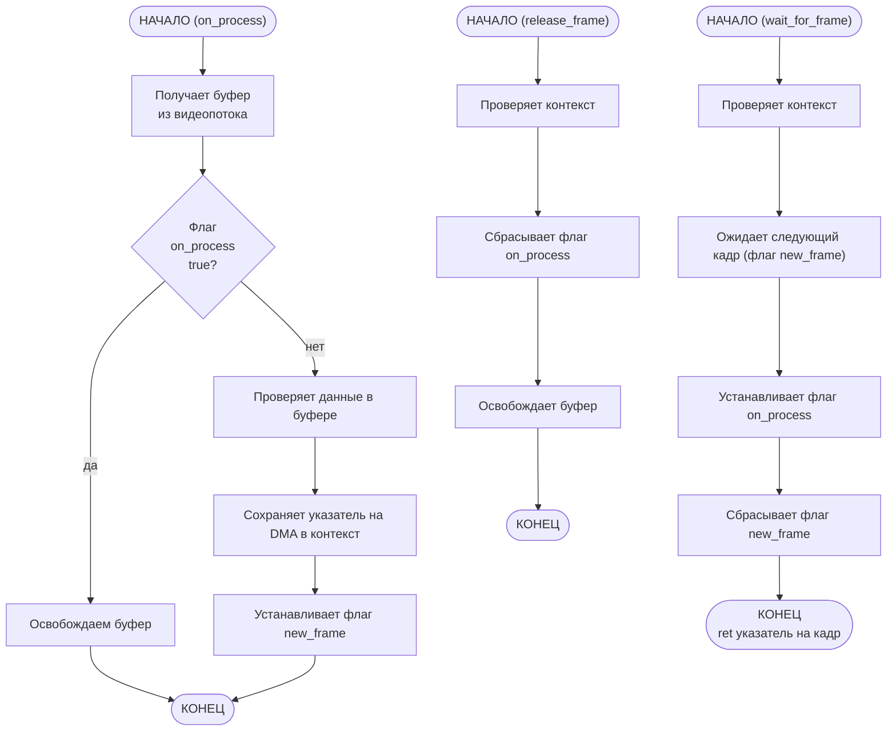

# C-worker: Модуль захвата изображения

C-worker — это модуль на чистом C для захвата экрана в Wayland, который является основным поддерживаемым дисплейным сервером в KDE Plasma 6 (Manjaro).

## Описание

Данный модуль является FFI (Foreign Function Interface) прослойкой для Rust. Он предоставляет набор функций, позволяющих получить доступ к DMA PipeWire.

## Решения

### Подход

Из возможных подходов были:
 *  FFI
 *  Параллельные процессы с обменом данными (например, через сокеты)
 *  Прямое взаимодействие с Wayland API из Rust
 *  Готовые библиотеки для взаимодействия с Wayland API

FFI подход был выбран по нескольким причинам:
 1) Полная **независимость от комьюнити**, чего не всегда могут предоставить готовые Rust-библиотеки для взаимодействия с PipeWire API. Здесь самостоятельно реализован ограниченный набор необходимых функций согласно текущей документации PipeWire.
 2) Обеспечена **максимальная скорость обмена данными**: вместо дополнительного копирования передаётся указатель на DMA.
 3) **Wayland и PipeWire ориентированы на C-экосистему**, поэтому разработка низкоуровневого слоя на C проще и гибче при работе с API.

### Интерфейс модуля

Основной структурой состояния является `capture_context_t`, реализация которой инкапсулирована. Пользователю доступна `capture_config_t` — структура конфигурации с параметрами экрана.

Остальной функционал предоставлен следующими функциями:

 * **`screen_capture_init`** — принимает указатель на конфигурацию и возвращает контекст для дальнейшего взаимодействия.
 * **`screen_capture_run`** — запускает захват экрана.
 * **`wait_for_frame`** — блокирующая функция, возвращает DMA-указатель на кадр.
 * **`release_frame`** — освобождает кадр после обработки.
 * **`screen_capture_stop`** — останавливает захват экрана.

### Синхронизация между потоками

Для синхронизации потоков используются `wait_for_frame` и `release_frame`, реализующие классический механизм Producer-Consumer, где Producer — `on_process`, а Consumer — Rust-код, вызывающий `wait_for_frame`.

<u>Механизм захвата следующий:</u>

Тогда в Rust порядок обработки кадра:
 1) вызывается `wait_for_frame`
 2) обрабатываются данные из DMA
 3) вызывается `release_frame`

### Ограничения и допущения

 * Модуль ориентирован на Wayland + PipeWire.
 * Для доступа к экрану требуется разрешение через портал.
 * Корректная работа обмена кадрами предполагает быстрый вызов `release_frame` после обработки.