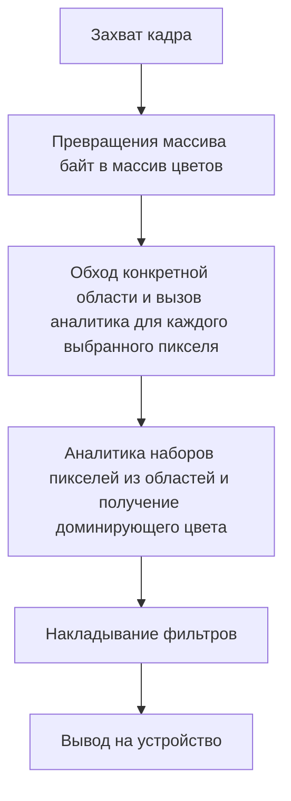
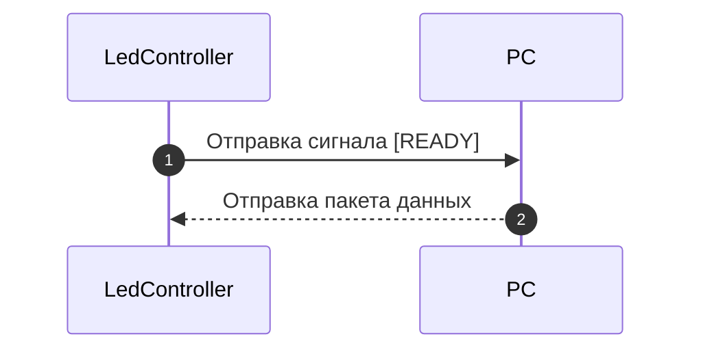
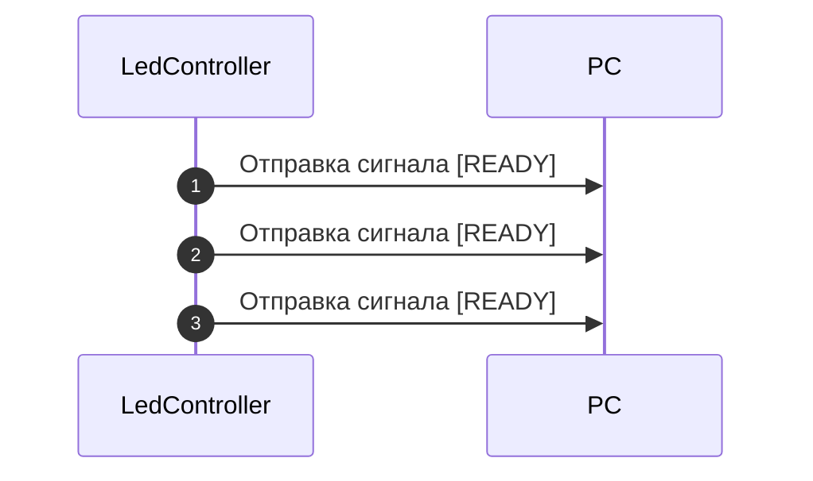

[](./manual.ru.md)

# Guide to Setting Up and Using `shinombra` Dynamic Backlighting

This guide contains detailed steps for the complete setup and further use of `shinombra`.

If you run into an unsolvable problem, try to find a similar question in `FAQ.md`. In other cases, follow the guidance in the logs - they always state the cause of the error.

Don't be intimidated by the table of contents - for a quick setup, it's enough to complete only the first 4 steps =).

## Table of Contents
- [Step 1. Choosing a Configuration](#step-1-choosing-a-configuration)
- [Step 2. Monitor Dimensions, Strip Position, and Reading Zone](#step-2-monitor-dimensions-strip-position-and-reading-zone)
  - [2.1. Monitor Dimensions](#21-monitor-dimensions)
  - [2.2. Strip Position](#22-strip-position)
  - [2.3 Reading Zone](#23-reading-zone)
- [Step 3. Connecting the Strip](#step-3-connecting-the-strip)
  - [3.1. Connecting to the Controller](#31-connecting-to-the-controller)
  - [3.2. Connecting to the PC](#32-connecting-to-the-pc)
    - [DDP](#ddp)
    - [DRGB](#drgb)
    - [ShinombraSerial](#shinombraserial)
    - [Debug](#debug)
- [Step 4. Configuring the Service](#step-4-configuring-the-service)
- [How Shinombra Processes a Frame](#how-shinombra-processes-a-frame)
- [Step 5. Configuring the Fragment Processor](#step-5-configuring-the-fragment-processor)
  - [Checkerboard](#checkerboard)
  - [CrawlCheckerboard](#crawlcheckerboard)
- [Step 6. Configuring the Analyst](#step-6-configuring-the-analyst)
  - [Average](#average)
  - [Histogram](#histogram)
  - [DebugRgb](#debugrgb)
- [Step 7. Limiting FPS](#step-7-limiting-fps)
- [Step 8. Configuring Filters](#step-8-configuring-filters)
  - [NoFilter](#nofilter)
  - [EMA](#ema)
  - [Gamma](#gamma)
  - [BlackThreshold](#blackthreshold)
  - [SaturationBoost](#saturationboost)
  - [WhiteBalance](#whitebalance)
  - [ChannelGain](#channelgain)
  - [FlashGuard](#flashguard)
  - [Median](#median)
- [The Resulting Config](#the-resulting-config)
  - [Settings](#settings)
  - [Simple](#simple)
  - [Advanced](#advanced)
    - [1. Manifest](#1-manifest)
    - [2. Base config](#2-base-config)
    - [3. Overlays](#3-overlays)
- [UI](#ui)
- [TUI](#tui)
- [ShinombraSerial](#shinombraserial-1)
- [Conclusion](#conclusion)

## Step 1. Choosing a Configuration

Before you start setting up the backlight, you need to decide on the desired configuration mode.

The entire backlight configuration is specified only in TOML format.

The backlight supports 2 modes:
1) simple - a single file is used for configuration;
2) advanced (enabled by default) - configuration uses a system based on a manifest (`manifest`), which contains the service settings, as well as the paths to the base config (`base_config`) and the paths to the "overlay layers" (`overlays`). More details on this setup are given in the [configuration section](#advanced).

Depending on the chosen configuration mode, various interfaces are available for convenience:
1) for simple mode - the web UI `shinombra-ui`. More details on it are given in the [UI section](#ui);
2) for advanced mode you can use any text editor along with this guide, as well as the TUI `shinombra-tui` for conveniently editing the manifest. More details on it are given in the [TUI section](#tui).

After choosing a convenient mode, you should take measurements of your monitor screen.

## Step 2. Monitor Dimensions, Strip Position, and Reading Zone

To measure the monitor and the strip position, you'll need any convenient measuring tool: a ruler, a tape measure, calipers, or anything else with a millimeter scale.

It's also necessary to introduce a strict concept: an ***LED block*** is a group of adjacent LEDs numbering 1 + n, where n is a natural number, *(group)* which is controlled by a single color and cannot be split into a smaller block. In other words, it's a strip segment controlled by <u>one</u> chip (such as `WS2811`), which is why all the LEDs on that segment receive the same input color. Typically, an LED block is bounded on both sides by a spot where the strip can be cut without damaging its functionality. An LED block is shown in the image below as a strip segment outlined in a red rectangle.

<p align="center">
  
</p>

The program will automatically project the strip's position behind the monitor onto the screen, so the accuracy of your measurements directly affects the correctness of the capture zone readings for each LED block.

Strictly follow the steps below for a correct setup.

### 2.1. Monitor Dimensions

The monitor dimensions are filled in in the `[screen_config]` table.

You need to measure the display (the surface capable of displaying an image) without the plastic/metal bezels. You'll need the screen's height and width in millimeters. An example of exactly how to take these measurements from the screen is illustrated in the figure below:

<p align="center">
  
</p>

The resulting values are entered into the corresponding fields: `frame_width_mm` for width and `frame_height_mm` for height.

Example of filling in the table:
```toml
[screen_config]
frame_width_mm = 590
frame_height_mm = 330
```

Once the screen dimensions are measured, you can move on to measuring the strip.

### 2.2. Strip Position

The strip position is entered in the `[led_position_config]` table.

It's assumed that the strip has the same number of LEDs on parallel sides, and that the strip is mounted with the same gap from the edge of the display on each side.

You need to measure and enter 4 values:
 - `gap` - the gap from the middle of the strip (i.e., from the physical center of the LED itself on the strip) to the edge of the display (excluding bezels). If the strip is mounted with <u>different</u> gaps, specify the <u>smallest</u> one, but keep in mind that in this case the capture zones may be less accurate;
 - `led_length` - the size of a single LED block measured exactly between the points where a cut can be made (what an LED block is can be read about at the start of [step two](#step-2-monitor-dimensions-strip-position-and-reading-zone));
 - `vertical_led_amount` - the number of LED blocks on one vertical side of the strip;
 - `horizontal_led_amount` - the number of LED blocks on one horizontal side of the strip.

A schematic measurement of the `gap` is shown in the figure below, where the strip is depicted in blue and intentionally enlarged.

<p align="center">
  
</p>

Example of filling in the table:
```toml
[led_position_config]
gap = 10
led_length = 62
vertical_led_amount = 5
horizontal_led_amount = 9
```

### 2.3 Reading Zone

You should also set up the reading parameters here so that the capture zone precisely matches the strip.

This setting is stored in the `[screen_reading_config]` table. 2 parameters are required:
 - `deep_in`: reading toward the center of the screen (in mm);
 - `deep_out`: reading away from the center of the screen (in mm. Must be $< gap$).

<p align="center">
  
</p>

Example of filling in the table:
```toml
[screen_reading_config]
deep_in = 10
deep_out = 5
```

Recommended parameters:
 - `deep_in`: ~10-20;
 - `deep_out`: ~50% of `gap`.

It's recommended to set the reading zone to a width of ~10-20 mm.

After measuring the strip's position on the monitor and setting up the reading zone, you can move on to the next step.

## Step 3. Connecting the Strip

Now you need to sort out connecting the strip to the controller and the computer so that `shinombra` can correctly control the backlight.

### 3.1. Connecting to the Controller

The strip connection parameters are entered in the `[frame_connection_config]` table.

It's assumed that the strip fully wraps around the edges of the monitor, i.e., it has no gaps, and that it's connected starting at one of the sides and continuing in a chain from there. Unfortunately, any other layout is not currently supported.

**Important:** the sides and directions are determined based on the position when you're looking <u>at the monitor screen</u>, i.e., in a normal working position.

You need to specify 2 parameters:
 - `start_from` - the side that's connected to the controller;
 - `direction` - the direction in which the sides of the strip are connected to each other.

For `start_from` there are 4 options, corresponding to the sides:
 - `Left`
 - `Up`
 - `Right`
 - `Down`

For `direction` there are 2 options:
 - `Clockwise`
 - `Counterclockwise`

A simple table for quickly determining the direction (again, we're looking **at** the display):
| Side of the strip the controller is connected to | Where you can see the wire going to the controller from |     direction      |
| :----------------------------------------------: | :-----------------------------------------------------: | :----------------: |
|                       Left                       |                         Bottom                          |    `Clockwise`     |
|                       Left                       |                           Top                           | `Counterclockwise` |
|                       Top                        |                          Left                           |    `Clockwise`     |
|                       Top                        |                          Right                          | `Counterclockwise` |
|                      Right                       |                           Top                           |    `Clockwise`     |
|                      Right                       |                         Bottom                          | `Counterclockwise` |
|                      Bottom                      |                          Right                          |    `Clockwise`     |
|                      Bottom                      |                          Left                           | `Counterclockwise` |

Example of filling in the table for a strip connected at the bottom-left (i.e., clockwise), as shown in the picture below:
```toml
[frame_connection_config]
start_from = "Left"
direction = "Clockwise"
```

<p align="center">
  
</p>

After specifying the connection, you can move on to configuring the PC communication protocols.

### 3.2. Connecting to the PC

This setting is specified in the `[settings]` table, in the `hardware_output_type` field. The other fields of this table are described in detail in the [configuration section](#settings).

At the moment, the strip supports a limited number of protocols, namely:
 - [DDP](#ddp);
 - [DRGB](#drgb);
 - [ShinombraSerial](#shinombraserial) - a custom protocol, described in more detail in the [section on the custom protocol](#shinombraserial-1);
 - [Debug](#debug) - debug output to the console.

Depending on the protocol your device supports, you need to enter the data according to one of the sections below.

#### DDP

When choosing the DDP protocol, you need to set `hardware_output_type = "Ddp"`; the protocol's own settings go into the `[ddp_config]` table.

The setting requires only one mandatory field, `ip`, into which you can enter either an IP address or a DNS name.

The following settings are <u>not mandatory</u> and may negatively affect the protocol's operation. Only specify them if you're sure:
 - `port` - the port on which the device expects to receive packets (`4048` by default);
 - `mtu` - the packet size in bytes on your network (`1500` by default). Depends on the router and the way you connect to the network. Needed for correctly splitting the stream into packets.

For the algorithm to work correctly, it's recommended to limit the FPS to within [60; 100] depending on the number of LED blocks in your strip. You can read about how to do this in the section [on limiting FPS](#step-7-limiting-fps).

Example of filling in the table:
```toml
[settings]
hardware_output_type = "Ddp"
...

[ddp_config]
ip = "led.local"
```

#### DRGB

When choosing the DRGB protocol from Wled, you need to set `hardware_output_type = "WledDrgb"`; the protocol's own settings go into the `[wled_drgb_config]` table.

The setting requires only one mandatory field, `ip`, into which you can enter either an IP address or a DNS name.

The following settings are <u>not mandatory</u> and may negatively affect the protocol's operation. Only specify them if you're sure:
 - `port` - the port on which the device expects to receive packets (`21324` by default);
 - `timeout` - the maximum time the device waits for a packet (`2` by default). If a packet doesn't arrive within the set time, the device makes a decision based on its internal program, usually switching to standby mode.

For the algorithm to work correctly, it's recommended to limit the FPS to within [60; 100] depending on the number of LED blocks in your strip. You can read about how to do this in the section [on limiting FPS](#step-7-limiting-fps).

Example of filling in the table:
```toml
[settings]
hardware_output_type = "WledDrgb"
...

[wled_drgb_config]
ip = "led.local"
```

#### ShinombraSerial

When choosing the ShinombraSerial protocol, you need to set `hardware_output_type = "ShinombraSerial"`; the protocol's own settings go into the `[shinombra_serial_config]` table. More details on the protocol itself are given in the [section on the custom protocol](#shinombraserial-1).

The setting requires only two parameters:
 - `port_path` - the path to the device. Usually `/dev/ttyUSBx`;
 - `baud_rate` - the data transfer rate over Serial (read more in the protocol description).

Before starting, make sure your user is in the `uucp` group for Arch or the `dialout` group for Debian.

Example of filling in the table:
```toml
[settings]
hardware_output_type = "ShinombraSerial"
...

[shinombra_serial_config]
port_path = "/dev/ttyUSB0"
baud_rate = 2000000
```

#### Debug

When choosing debug output, you need to set `hardware_output_type = "Debug"`.

This option has no settings of its own. It prints to the console a frame made up of LED blocks, colored with the values obtained after analytics and filtering. It's needed exclusively for debugging.

For it to work, your terminal must support ANSI characters.

Example of filling in the table:
```toml
[settings]
hardware_output_type = "Debug"
...
```

After setting up the device connection, you can move on to configuring the service.


## Step 4. Configuring the Service

By default, `shinombra` is installed as a unit service, but if you wish, you can use it as a regular program by calling it by name in the terminal.

Depending on the chosen configuration mode, these settings should be located in the manifest for advanced mode, or in the config file for simple mode. More details on this are given in the [configuration section](#the-resulting-config).

The service settings are specified in the `[daemon_settings]` table.

To start the service, you need to specify the following parameters:
 - `log_level` - the logging level;
 - `pipewire_conversion` - permission for type conversion by PipeWire (you can read more about this in the [section on frame processing](#how-shinombra-processes-a-frame));
 - `save_token` - permission to save the PipeWire session token (needed for automatically starting the service without having to grant screen capture permission every time).

Several logging levels are available:
 - `Off` - logs are completely disabled;
 - `Error` - critical errors only;
 - `Warn` - warnings;
 - `Info` - information about the current state;
 - `Debug` - debug output;

Each log level limits the output so that only logs of a similar level or a level higher than the one chosen are shown. That is, when setting `log_level = Warn`, both warnings and critical errors will be shown.

The `save_token` flag controls saving the PipeWire session token to a binary file at `~/.local/share/shinombra/session.bin`. The token is stored in encrypted form. It's needed so that the screen selection window doesn't appear every time the service starts.

Example of filling in the table:
```toml
[daemon_settings]
log_level = "Warn"
pipewire_conversion = false
save_token = true
```

The following chapters are needed for more precise strip configuration and understanding the internal processes. If you're already eager to try `shinombra` in action, I recommend using the [presets](./presets.ru.md).

## How Shinombra Processes a Frame

This section is purely informational and is only needed to give you a better understanding of exactly how the settings affect the program's operation. However, if you wish, you can skip it and go straight to the [next step](#step-5-configuring-the-fragment-processor).

Before discussing the internal logic of the program, it's important to introduce some strict concepts:
 - a ***frame*** - the array of pixels the program processes (the entire picture on the screen);
 - a ***frame fragment*** - part of a frame in the form of a rectangular area that was assigned to a specific [LED block](#step-2-monitor-dimensions-strip-position-and-reading-zone) as a result of the projection;
 - a ***processor / fragment walker*** - an algorithm that traverses a fragment in a specific way and sends the data for analysis;
 - an ***analyst*** - an algorithm that deals only with analyzing the color obtained from the processor. As a result of analyzing the array of colors from the fragment, it computes the dominant color;
 - a ***formatter*** - an algorithm that turns a set of bytes into a color in RGB format.

Before turning into electrical signals on your strip, a frame goes through a certain processing pipeline (simplified diagram):


Moreover, the traversal and analysis of each fragment happens sequentially, which is dictated by architectural decisions. And a capture happens if and only if PipeWire sends an updated frame, i.e., processing is triggered when the frame changes, unless, of course, the FPS is limited, which you can read about in the section on [limiting FPS](#step-7-limiting-fps).

At the moment, the program supports a limited number of the most common formatters (all variations of RGB), but there's a chance that your system is built entirely on a different format. This is exactly why the `[daemon_settings] pipewire_conversion` flag exists, which allows PipeWire to try to convert your system's format on the fly into a form `shinombra` understands. However, this setting entails increased resource usage, since, unfortunately, PipeWire will convert and copy the entire frame, even though `shinombra` typically analyzes less than ~10% of it.

It's also important to mention that filters and analysts can work in different formats, namely RGB and HSV. To avoid unnecessary conversions, a smart wrapper was created that converts the format only when required. However, it's important to keep in mind that performance depends on the order of the filters. You can find out which format each filter works in in the section [on filters](#step-8-configuring-filters), right before the example of filling in the table for each filter, as well as at the end of that section.

Having formed a general picture of how the program works, you can move on to its direct configuration.


## Step 5. Configuring the Fragment Processor

The choice of processor is specified in the `[settings]` table, in the `chunk_processor_type` field. You can read more about this table in the [configuration section](#settings).

Available options:
 - [Checkerboard](#checkerboard) - for calm and measured videos / movies;
 - [CrawlCheckerboard](#crawlcheckerboard) - for dynamic and sharp scenes / active games.

Each option is described in detail in the corresponding section below.

### Checkerboard

Traversal in a static "checkerboard" order, or in the form of a "grid." This processor always skips a certain number of rows and columns, so that only a small part of the fragment, not the whole thing, is analyzed. The capture principle is illustrated in the figure below, where the pixels that go into the analysis are marked in blue.

<p align="center">
  
</p>

This processor is well suited for calm videos, movies, ordinary web browsing, and similar situations, since it doesn't create interference and produces a stable result. However, it's important to keep in mind that, due to how it works, it can miss small details.

The settings for this processor are stored in the `[checkerboard_config]` table (don't forget to specify the chosen processor in the `[settings]` table). 2 parameters need to be filled in:
 - Every pixel whose "number" is a multiple of `pixel_step` will be read;
 - Every row whose "number" is a multiple of `row_stride` will be read.

Example of filling in the table for the parameters from the figure:
```toml
[settings]
chunk_processor_type = "Checkerboard"
...

[checkerboard_config]
# Every third pixel in a row is read
pixel_step = 3
# Every fourth row is read
row_stride = 4
```

Recommended values:
 - `pixel_step`: ~7-12;
 - `row_stride`: ~4-6.

<u>The smaller</u> the values set, <u>the more</u> pixels will go into the analysis.

### CrawlCheckerboard

This processor works on a principle similar to [Checkerboard](#checkerboard), but instead of staying static, it constantly shifts the reading grid over the course of the frames. The capture principle is illustrated in the figure below, where blue again marks the pixels that go into the analysis, and gray marks the pixels that were captured on the previous frame.

<p align="center">
  
</p>

This processor is well suited for very dynamic games and movies. Thanks to the grid shifting, the analysis turns out more fair and practically all pixels end up in the frame (depending on the settings), but because of this, the LEDs may flicker on static images. To smooth out this negative effect, it's recommended to use the [EMA](#ema) and [Median](#median) filters.

The settings for this processor are stored in the `[crawl_checkerboard_config]` table (don't forget to specify the chosen processor in the `[settings]` table). 4 parameters need to be filled in:
 - Every pixel whose "number" is a multiple of `pixel_step` will be read;
 - Every row whose "number" is a multiple of `row_stride` will be read;
 - `column_crawl` - the number of columns the grid will shift by;
 - `row_crawl` - the number of rows the grid will shift by.

Example of filling in the table for the parameters from the figure:

```toml
[settings]
chunk_processor_type = "CrawlCheckerboard"
...

[crawl_checkerboard_config]
# Every third pixel in a row is read
pixel_step = 3
# Every fourth row is read
row_stride = 4
# On the next frame, the grid will shift by 2 columns
column_crawl = 2
# On the next frame, the grid will shift by 3 rows
row_crawl = 3
```

Recommended values:
 - `pixel_step`: ~7-12;
 - `row_stride`: ~4-6;
 - `column_crawl`: ~1-5;
 - `row_crawl`: ~1-5.

Here, similarly to [Checkerboard](#checkerboard), <u>the smaller</u> the values set, <u>the more</u> pixels will go into the analysis. Also, to avoid LED flickering, it's not recommended to set the grid shift parameters to values that are too large, and there's no point setting `column_crawl = pixel_step` or `row_crawl = row_stride`. This won't break the program's logic, but it won't give any benefit either.


## Step 6. Configuring the Analyst

The choice of analyst is specified in the `[settings]` table, in the `analytics_type` field. You can read more about this table in the [configuration section](#settings).

Available options:
 - [Average](#average) - less accurate, but more performant;
 - [Histogram](#histogram) - maximally accurate, but less performant;
 - [DebugRgb](#debugrgb) - for debugging.

Each option is described in detail in the corresponding section below.

### Average

The simplest arithmetic mean. For the pixels obtained, the average value is calculated across the red, green, and blue channels.

This algorithm is as simple as possible and extremely cheap in terms of performance. However, its major downside is that it doesn't compute a dominant color as such. For example, if a white line appears on a black scene, the algorithm will produce a gray color.

Below are examples of how it performs on various images. First comes the source image, then followed by the same semi-transparent image with the LED block values overlaid (without filters):

<p align="center">
  
  
  
  
</p>

\* the blocks shown are intentionally exaggerated in size and are in reality ~2 times thinner.

The arithmetic mean has no settings field of its own.

Example of filling in the table:
```toml
[settings]
analytics_type = "Average"
...
```

### Histogram

The algorithm for calculating the dominant color based on weighted histograms is one of the most accurate for determining the dominant color. It works on a voting system in HSV space. The color wheel is divided into conditional zones for voting. Each pixel that goes into the analysis votes for a specific section of the wheel. The vote is the product of brightness and saturation, since the human eye perceives more saturated and bright colors as much better and "more dominant" than dull and dark ones. If a pixel is dull, it votes for a separate designated bucket, needed for black and white colors. When calculating the dominant color, the bucket with the most votes is found; the hue is taken as the middle of the wheel section, and the saturation and brightness as the average over the pixels that voted for the winning bucket.

This algorithm is very accurate, but requires far more resources than [Average](#average). In exchange, the result is as accurate as possible.

Below are examples of how it performs on various images. First comes the source image, then followed by the same semi-transparent image with the LED block values overlaid (without filters):

<p align="center">
  
  
  
  
</p>

\* the blocks shown are intentionally exaggerated in size and are in reality ~2 times thinner. The calculations were performed at the maximum accuracy level.

For this algorithm, you can choose the accuracy level using the `precision_level` setting in the `[histogram_config]` table. The precision level is limited to [1; 20]. The resulting number of buckets $= precision\_level \cdot 6$. That is, setting `precision_level = 20` gives you an analysis over 120 buckets, which is very precise, since each voting section covers only 3 degrees of the wheel, something the human eye practically can't distinguish.

Example of filling in the table:
```toml
[settings]
analytics_type = "Histogram"
...

[histogram_config]
precision_level = 20
```

The chosen precision directly affects performance. <u>The higher</u> the precision, <u>the more</u> resources are consumed.

### DebugRgb

This is debug output. It's useful if you want to fine-tune color accuracy or fill the entire strip with a single color.

This option doesn't compute anything and simply outputs the color from the configuration.

The configuration is stored in the `[debug_rgb_config]` table and has 3 parameters: `red`, `green`, and `blue`, corresponding to a regular RGB pixel. These values are limited to the range [0; 255].

Example of filling in the table:
```toml
[settings]
analytics_type = "DebugRgb"
...

[debug_rgb_config]
red = 50
green = 50
blue = 50
```

After choosing an analyst, you can set up the FPS limit.


## Step 7. Limiting FPS

Since some protocols don't support data transmission above certain FPS values, and since on average the human peripheral vision can't notice the difference between a picture refreshing at 60 Hz and any rate above that, `shinombra` is able to limit the frame rate at the frame capture level, simply discarding frames that arrive at the wrong time.

This setting is entered in the `[settings]` table, in the `max_fps` field. You can read more about this table in the [configuration section](#settings).

The frame rate limit is optional. You can set the limit to any natural number greater than zero, or not limit it at all.

Example of filling in the table:
```toml
[settings]
max_fps = 60
...
```

After limiting the FPS, you can move on to configuring filtering.


## Step 8. Configuring Filters

Because color reproduction on the monitor and on the LED strip usually doesn't match, and also because you might be sitting across from a wall that isn't perfectly white but instead colored wallpaper, `shinombra` supports a rich filtering system that provides you with a beautiful, customizable picture.

All filters are entered into the `[settings]` table, in the `filter_chain` field, as an array in the order in which they need to be applied, left to right.

Example for sequential filtering `EMA -> WhiteBalance -> Gamma`:
```toml
[settings]
filter_chain = ["Ema", "WhiteBalance", "Gamma"]
...
```

It's important to understand that filters can be arranged in any order and duplicated, but the settings for a specific filter can only appear once, in the corresponding field. For example, you can't add 2 EMA filters with different `alpha` values to the chain - the configuration system doesn't support this.

Available options:
 - [NoFilter](#nofilter) - no filter;
 - [Ema](#ema) - makes the picture's changes smoother;
 - [Gamma](#gamma) - corrects brightness for human perception;
 - [BlackThreshold](#blackthreshold) - smart cutoff of dim colors (via a piecewise function);
 - [SaturationBoost](#saturationboost) - smart saturation increase;
 - [WhiteBalance](#whitebalance) - white balance setting (warmth in kelvins);
 - [ChannelGain](#channelgain) - precise channel adjustment;
 - [FlashGuard](#flashguard) - protection from flashes;
 - [Median](#median) - protection from random outliers.

Each filter is described in detail in the corresponding section below.

To correctly understand the formulas, it's important to first lay out the ranges for the representation formats:
 - **RGB**:
   - red: [0; 255]
   - green: [0; 255]
   - blue: [0; 255]
 - **HSV**:
   - hue: [0; 1]
   - saturation: [0; 1]
   - value: [0; 255]

\* these ranges were chosen for the author's convenience of work and understanding

### NoFilter

The complete absence of a filter. Needed if you don't need any data filtering at all.

Example of filling in the table:
```toml
[settings]
filter_chain = ["NoFilter"]
...
```

### EMA

EMA (exponential moving average) is a filter needed for smoothing a sharp picture. It doesn't let the picture change instantly, but instead slightly smooths the spike of change over time, so that the picture looks softer and smoother. The following formula is used to calculate each channel:

$$C_{out} = C_{in} \cdot \alpha + C_{prev} \cdot (1 - \alpha)$$

where:
 - $C_{in}$ - the channel value (each of RGB separately) coming into the filter;
 - $C_{prev}$ - the previous channel value that the filter output;
 - $C_{out}$ - the result for the channel.

This filter has settings in the `[ema_config]` table. The single parameter `alpha` controls how strongly the new color affects the change, so this coefficient is limited to the range $(0; 1]$. <u>The smaller</u> `alpha`, <u>the smoother</u> the picture becomes.

It's also important to understand that EMA depends directly on the FPS value. <u>The lower</u> the FPS, <u>the more</u> EMA will smooth the picture at the same `alpha`.

<p align="center">
  
</p>

EMA operates in RGB space.

Example of filling in the table:
```toml
[settings]
filter_chain = [..., "Ema", ...]
...

[ema_config]
alpha = 0.1
```

Recommended parameters:
 - For dynamic games, `alpha`: 0.4-0.6 at FPS ~60;
 - For calm movies, `alpha`: 0.2-0.5 at FPS ~60.

### Gamma

Gamma is a standard filter designed to correct brightness changes according to the structure of the human eye. As a result of evolution, humans learned to distinguish differences in dim colors more strongly than in bright ones, i.e., a change in brightness ($[0; 255]$) $0 \to 1$ will be noticeably stronger than $254 \to 255$, so gamma turns the results of frame analysis into colors that are pleasant for humans, using a power function (for normalized brightness, i.e., the range $[0; 1]$):

$$V_{out} = V_{in}^{\gamma}$$

where:
 - $V_{in}$ - the brightness coming into the filter;
 - $V_{out}$ - the resulting brightness.

This filter has settings in the `[gamma_config]` table. The single parameter `gamma` controls the "steepness" of the brightness conversion curve. <u>The higher</u> the exponent, <u>the steeper</u> the curve becomes. For tuning, you can use a simple rule: "if the picture feels darker than the strip, then `gamma` should be raised. Otherwise, lower it." This parameter is limited to the range $[0; \infty)$.

<p align="center">
  
</p>

Gamma operates in RGB space.

Example of filling in the table:
```toml
[settings]
filter_chain = [..., "Gamma", ...]
...

[gamma_config]
gamma = 2.2
```

Recommended parameters:
 - For most LED strips, `gamma`: ~2.0-2.4.

### BlackThreshold

BlackThreshold - the dim-color cutoff - is needed for cutting off colors close to black. Its operating principle overlaps with the [Gamma filter](#gamma), but the cutoff filter allows for more precise control of `shinombra`'s behavior, since it works on a specific section. It also allows you to create a zone with a smoother change in brightness and saturation, described in more detail below. The calculations are performed using the formula:

$$
\begin{cases}  
V_{out} = 0, \quad S_{out} = 0 & \text{если } V_{in} < V_{threshold} \\
V_{out} = V_{in} \cdot (k(V_{in}))^{\mathit{falloff\_exponent}} & \text{если } V_{threshold} \le V_{in} < V_{threshold} + V_{fade\_range} \\
S_{out} = S_{in} \cdot k(V_{in}) & \text{если } V_{threshold} \le V_{in} < V_{threshold} + V_{fade\_range} \\
V_{out} = V_{in}, \quad S_{out} = S_{in} & \text{если } V_{in} \ge V_{threshold} + V_{fade\_range}
\end{cases}
$$

$$
\begin{aligned}
V_{threshold} &= \frac{threshold \cdot 255}{100} \\
V_{fade\_range} &= \frac{fade\_range \cdot 255}{100} \\
k &= \frac{V_{in} - V_{threshold}}{V_{fade\_range}}
\end{aligned}
$$

where:
 - $V_{in}$ - the brightness coming into the filter;
 - $S_{in}$ - the saturation coming into the filter;
 - $V_{out}$ - the resulting brightness;
 - $S_{out}$ - the resulting saturation.

This filter's settings are stored in `[black_threshold_config]`. 3 parameters need to be specified:
 - `threshold` - the minimum brightness threshold below which all colors are considered black (in the range $[0; 100]\%$);
 - `fade_range` - the width of the range after the minimum threshold in which the smooth color transition operates (in the range $[0; 100 - threshold]\%$);
 - `falloff_exponent` - the "steepness" of the curve that operates within that range (in the range $[0; \infty)$ mathematically, but is meaningful at values greater than 1).

\* In the formulas, of course, `threshold` and `fade_range` are converted to the corresponding range.

<p align="center">
  
</p>

Below are graphs of the effect at `threshold = 10%`, `fade_range = 10%`, `falloff_exponent = 1.5`:
<p align="center">
  
  
</p>

BlackThreshold operates in HSV space.

Example of filling in the table:
```toml
[settings]
filter_chain = [..., "BlackThreshold", ...]
...

[black_threshold_config]
threshold = 6
fade_range = 10
falloff_exponent = 1.5
```

Recommended parameters:
- `threshold`: 5-15%;
- `fade_range`: 5-15%;
- `falloff_exponent`: 1.2-2.0.

### SaturationBoost

SaturationBoost is a filter needed to increase the saturation of the resulting color. It compensates for the saturation loss caused by the physical properties and placement conditions of the strip. When passing through a diffuser, as well as when reflecting off a wall, light loses saturation. The following formula is used for correction:

$$
\begin{cases}
S_{out} = 0 & \text{если } S_{in} < S_{floor} \quad \text{(полное отсечение)} \\
S_{out} = \left(\frac{S_{in} - S_{floor}}{1 - S_{floor}}\right)^{\mathit{boost\_exponent}} & \text{если } S_{in} \ge S_{floor} \quad \text{(плавное увеличение)}
\end{cases}
$$

$$
S_{floor} = \frac{floor}{100} \quad \text{(перевод из процентов)}
$$

where:
 - $S_{in}$ - the saturation coming into the filter;
 - $S_{out}$ - the resulting saturation.

This filter's settings are stored in the `[saturation_boost_config]` table and require specifying 2 parameters:
 - `floor` - the threshold below which saturation is brought down to 0 (in the range $[0; 100)\%$);
 - `boost_exponent` - the "steepness" of the curve by which saturation is increased (in the range $[1; \infty)$).

Below is a graph of the effect at `floor = 10%`, `boost_exponent = 1.5`:
<p align="center">
  
</p>

SaturationBoost operates in HSV space.

Example of filling in the table:
```toml
[settings]
filter_chain = [..., "SaturationBoost", ...]
...

[saturation_boost_config]
floor = 3
boost_exponent = 1.6
```

Recommended parameters:
 - `floor`: 7-12%;
 - `boost_exponent`: 1.4-1.8.

### WhiteBalance

WhiteBalance - white balance - is needed to correct the color tone of the strip, since blue LEDs usually appear brighter to humans, which makes the picture colder.

This filter's settings are stored in the `[white_balance_config]` table. You need to specify a single parameter, `kelvins` - the usual warmth in kelvins. The kelvin value must be strictly greater than 1000K, which is a limitation of the Tanner-Helland algorithm used. Also, due to the use of this algorithm, colors are correctly adjusted within roughly $[1000; 20000]K$ (this is a mathematical limitation from the approximation), however you can enter a value greater than 20000, since the math won't break because of it.

This filter operates in RGB space.

Example of filling in the table:
```toml
[settings]
filter_chain = [..., "WhiteBalance", ...]
...

[white_balance_config]
kelvins = 4000
```

Recommended values:
 - `kelvins`: ~3500-4500 (strongly depends on the specific strip and your preferences).

### ChannelGain

ChannelGain is a precise adjustment of the output channels. This filter lets you set coefficients for each of the RGB channels. It may be needed in exceptional cases, for example, if one of the channels on your strip is brighter than the others. It works simply by multiplying the channel by the given coefficient:

$$
  R_{out} = R_{in} * k\_red \\
  G_{out} = G_{in} * k\_green \\
  B_{out} = B_{in} * k\_blue \\
$$

where:
 - $x_{in}$ - the channel value (each of RGB separately) coming into the filter;
 - $x_{out}$ - the result for the channel.

The settings are stored in the `[channel_gain_config]` table. 3 mandatory parameters:
 - `k_red`: the coefficient for the red channel (in the range $[0; 1]$);
 - `k_green`: the coefficient for the green channel (in the range $[0; 1]$);
 - `k_blue`: the coefficient for the blue channel (in the range $[0; 1]$).

This filter operates in RGB space.

Example of filling in the table:
```toml
[settings]
filter_chain = [..., "ChannelGain", ...]
...

[channel_gain_config]
k_red = 1.0
k_green = 0.7
k_blue = 0.91
```

### FlashGuard

FlashGuard is a flash guard. It does **not** clip the brightness, but instead uses EMA smoothing for brightness whenever it goes beyond the allowed limit. That is, it doesn't dull the flash, but stretches it out over time and makes it smoother. The formula below is used for this:
$$
\begin{cases}
D = V_{in} - V_{prev} \quad \text{(разница с предыдущим значением)} \\
V_{out} = V_{prev} + \frac{\alpha}{1 + \left(\frac{|D|}{S}\right)^2} \cdot D \quad \text{(результат)}
\end{cases}
$$

$$
S = \frac{sensitivity \cdot 255}{100} \quad \text{(перевод из процентов)}
$$

This filter's settings are stored in the `[flash_guard_config]` table. 2 values need to be filled in:
 - `alpha` - the "smoothness" of the smoothing, as in the [EMA filter](#ema) (in the range $[0; 1]$);
 - `sensitivity` - the difference at which the filter triggers, i.e., the sensitivity (in the range $[0; 100]\%$). <u>The higher</u> `sensitivity`, <u>the sharper</u> the flashes that get smoothed, i.e., at `sensitivity = 50%`, flashes with a difference of more than half the maximum brightness will be smoothed. But it's also important to understand that the filter overall always smooths flashes, it's just that smaller flashes are smoothed more weakly (a dynamic alpha for EMA).

Below is a graph of the effect at `alpha = 0.5`, `sensitivity = 50%`:
<p align="center">
  
</p>

This filter operates in HSV space.

Example of filling in the table:
```toml
[settings]
filter_chain = [..., "FlashGuard", ...]
...

[flash_guard_config]
alpha = 0.5
sensitivity = 40
```

Recommended values:
 - `alpha`: 0.5-0.8;
 - `sensitivity`: 50-80%.

### Median

Median - a simple median filter - is needed for smoothing sharp random outliers. It acts as protection against flickering, needed for some analysts. This implementation is built on a fixed window of 3 elements, which allows it to avoid delaying a picture change for too long while still effectively removing random spikes.

This filter has no settings.

Below is an example of its effect:
<p align="center">
  
</p>

This filter operates in RGB space.

Example of filling in the table:
```toml
[settings]
filter_chain = [..., "Median", ...]
...
```

---

Here's a small table of the color spaces each filter operates in, for those who love squeezing maximum performance out of the system:
|               Filter                | Space |
| :---------------------------------: | :---: |
|        [NoFilter](#nofilter)        |  RGB  |
|             [EMA](#ema)             |  RGB  |
|           [Gamma](#gamma)           |  RGB  |
|  [BlackThreshold](#blackthreshold)  |  HSV  |
| [SaturationBoost](#saturationboost) |  HSV  |
|    [WhiteBalance](#whitebalance)    |  RGB  |
|     [ChannelGain](#channelgain)     |  RGB  |
|      [FlashGuard](#flashguard)      |  HSV  |
|          [Median](#median)          |  RGB  |


Recommended filter order:
 1) [BlackThreshold](#blackthreshold) - immediately cuts off dim colors;
 2) [SaturationBoost](#saturationboost) - increases saturation;
 3) [FlashGuard](#flashguard) - cleans up flashes;
 4) [Median](#median) - removes outliers;
 5) [Ema](#ema) - smooths the picture;
 6) [WhiteBalance](#whitebalance) - corrects the finished picture's warmth;
 7) [Gamma](#gamma) - adapts brightness.

```toml
[settings]
filter_chain = ["BlackThreshold", "SaturationBoost", "FlashGuard", "Median", "Ema", "WhiteBalance", "Gamma"]
...
```

Congratulations, the backlight is now fully configured! 🎉

The following chapters will go into more detail on how to use the UI and TUI, and will explain what the final complete configuration should look like.


## The Resulting Config

Depending on the chosen configuration mode, it will look different. Each variant is described in detail in the corresponding sections below.

### Settings
It's important to say right away about the `[settings]` table, since it hasn't yet been fully described anywhere.

This table contains the settings for the entire color processing pipeline and contains:
 - `chunk_processor_type` - [the processor type](#step-5-configuring-the-fragment-processor);
 - `analytics_type` - [the analyst type](#step-6-configuring-the-analyst);
 - `filter_chain` - [the array of filters](#step-8-configuring-filters);
 - `hardware_output_type` - [the device output type](#32-connecting-to-the-pc);
 - `max_fps` - optionally, [the FPS limit](#step-7-limiting-fps).

Example of filling it in:
```toml
[settings]
chunk_processor_type = "CrawlCheckerboard"
analytics_type = "Histogram"
filter_chain = ["BlackThreshold", "SaturationBoost", "FlashGuard", "Median", "Ema", "WhiteBalance", "Gamma"]
hardware_output_type = "ShinombraSerial"
```

### Simple

When choosing the simple configuration, <u>all</u> settings are contained in a single file, which means it must contain the mandatory tables:
 - `[daemon_settings]`;
 - `[settings]`;
 - `[screen_config]`;
 - `[frame_connection_config]`;
 - `[screen_reading_config]`.

As well as any other necessary tables depending on the chosen settings.

**Important!** In simple mode, you need to add the `--config <path/to/file>` flag to the environment file (~/.config/shinombra/service.env) or directly to the service, since by default the program runs in advanced configuration mode.

### Advanced

When choosing the advanced configuration, `shinombra` starts assembling paths from different files:

#### 1. Manifest

The manifest is the collection point for the entire configuration. It contains 2 tables:
 - `[paths]` - paths to the configuration. Fields:
   - `config` - the main configuration file;
   - `overlays` - an array of paths to all the overlays.
 - `[daemon_settings]` - a table with the [service settings](#step-4-configuring-the-service).

Example of filling in the manifest:
```toml
[paths]
config = "configs/usual.toml"
overlays = ["overlays/gaming.toml", "overlays/night.toml"]

[daemon_settings]
log_level = "Error"
pipewire_conversion = false
save_token = true
```

#### 2. Base config

The base config is the place where you can store any configuration described in the steps above.

#### 3. Overlays

Overlays are layers that will override the assembled configuration. You don't need to fill in entire tables - it's enough to fill in only the field that needs to be overridden.

Say the base config contains the table:
```toml
[frame_connection_config]
start_from = "Up"
direction = "Clockwise"
```

And in the overlay:
```toml
[frame_connection_config]
start_from = "Down"
```

Then, as a result, we get the table:
```toml
[frame_connection_config]
start_from = "Down"
direction = "Clockwise"
```

Overlays are applied in the order they're listed. Keep this in mind, since overlays can override each other.

---

`Shinombra` runs in advanced configuration mode by default and looks for the manifest at the path \~/.config/shinombra/manifest.toml. If you want to explicitly specify the path to your own manifest, add the `--manifest <path/to/file>` flag to the environment file (\~/.config/shinombra/service.env).


## UI

The user interface is implemented as a simple website that lets you conveniently fill in the setting fields. Depending on the chosen options, the interface will show the structures that need to be filled in.

To launch the interface, run in the terminal:
```bash
shinombra-ui
```
And go to the link you get in the output. The output usually looks like this:
```
Server running on http://localhost:3000
```

On launch, you'll see a window prompting you to enter the path to the configuration file. If you want to skip this step, launch the UI with the command:
```bash
shinombra-ui --config <path/to/config>
```

At the very bottom there are 3 buttons:
 1) `Set Simple Mode in Service` - automatically writes the necessary flags to the environment file to switch `shinombra` into simple configuration mode. Needs to be clicked on first launch;
 2) `Restart Service` - a quick service restart. Needed to apply newly saved settings;
 3) `Save Settings` - saves the settings to the open file

If you need to run the server on a different port, use the `--port <port>` flag.

<details>
  <summary>Click to see what the configuration looks like</summary>
  <image src="./manual/ui.png">
</details>


## TUI

The TUI is a bash script based on `yq` and `gum`. It serves as a convenient manifest editor for quickly switching configurations in advanced mode.

To launch it, run:
```bash
shinombra-tui
```

With the TUI you can:
1) choose the [base config](#2-base-config);
2) choose the [overlays](#3-overlays);
3) restart the service;

If the TUI detects the `--config` flag, which enables simple configuration mode, in the standard environment file (~/.config/shinombra/service.env), the script will offer to remove that flag.


## ShinombraSerial

ShinombraSerial is a simple custom protocol that uses a Serial port for data transmission.

The data packet in this protocol consists of a sequence formed by the `AD` (AmbientData) sync word and an array of data in RGB format:
| Sync word |  R_1  |  G_1  |  B_1  |  R_2  |  G_2  |  B_2  |  ...  |
| :-------: | :---: | :---: | :---: | :---: | :---: | :---: | :---: |
|    AD     | data  | data  | data  | data  | data  | data  |  ...  |
 
It was decided not to implement checksums or the like, since the probability of interference on a short wire over the Serial protocol $\to 0$.

The protocol is based on a simple sequence of synchronization signals. In the standard sending process, the computer waits for a readiness signal, `[READY]`, from the controller, and upon receiving it, sends a data packet:


If the PC hasn't sent a data packet, the controller will keep repeating its request until a packet is sent.


For a proper shutdown, the protocol supports a `[TERM]` signal, which makes the controller turn off the strip. However, after this signal, the controller won't stop sending `[READY]`, which is done for convenience of use (there's no need to restart the controller).

Because of the simplicity of this protocol, it allows the strip to be used at high frequencies.


## Conclusion

I hope that, thanks to this guide, you'll be able to set up the backlight so that it brings you maximum enjoyment.

Thank you for using Shinombra!  
Best regards, Sanlexandro 🐈‍⬛