# Инструкция по настройке и применению динамической подсветки `shinombra`

Данная инструкция содержит подробные шаги для полной настройки и дальнейшего применения `shinombra`.

Если Вы столкнулись с какой-либо нерешаемой проблемой, попробуйте найти схожий вопрос в `FAQ.md`. В иных случаях следуйте инструкции в логах - они всегда называют причину ошибки.

Не пугайтесь оглавления - для быстрой настройки достаточно будет выполнить только первые 4 шага =).

## Оглавление
- [Шаг 1. Выбор конфигурации](#шаг-1-выбор-конфигурации)
- [Шаг 2. Размеры монитора, положение ленты и зона чтения](#шаг-2-размеры-монитора-положение-ленты-и-зона-чтения)
  - [2.1. Размеры монитора](#21-размеры-монитора)
  - [2.2. Положение ленты](#22-положение-ленты)
  - [2.3 Зона чтения](#23-зона-чтения)
- [Шаг 3. Подключение ленты](#шаг-3-подключение-ленты)
  - [3.1. Подключение к контроллеру](#31-подключение-к-контроллеру)
  - [3.2. Подключение к ПК](#32-подключение-к-пк)
    - [DDP](#ddp)
    - [DRGB](#drgb)
    - [ShinombraSerial](#shinombraserial)
    - [Debug](#debug)
- [Шаг 4. Настройка сервиса](#шаг-4-настройка-сервиса)
- [Как Shinombra обрабатывает кадр](#как-shinombra-обрабатывает-кадр)
- [Шаг 5. Настройка процессора фрагмента](#шаг-5-настройка-процессора-фрагмента)
  - [Checkerboard](#checkerboard)
  - [CrawlCheckerboard](#crawlcheckerboard)
- [Шаг 6. Настройка аналитика](#шаг-6-настройка-аналитика)
  - [Average](#average)
  - [Histogram](#histogram)
  - [DebugRgb](#debugrgb)
- [Шаг 7. Ограничение FPS](#шаг-7-ограничение-fps)
- [Шаг 8. Настройка фильтров](#шаг-8-настройка-фильтров)
  - [NoFilter](#nofilter)
  - [EMA](#ema)
  - [Gamma](#gamma)
  - [BlackThreshold](#blackthreshold)
  - [SaturationBoost](#saturationboost)
  - [WhiteBalance](#whitebalance)
  - [ChannelGain](#channelgain)
  - [FlashGuard](#flashguard)
  - [Median](#median)
- [Итоговый вид конфига](#итоговый-вид-конфига)
  - [Settings](#settings)
  - [Простая](#простая)
  - [Сложная](#сложная)
    - [1. Manifest](#1-manifest)
    - [2. Base config](#2-base-config)
    - [3. Overlays](#3-overlays)
- [UI](#ui)
- [TUI](#tui)
- [ShinombraSerial](#shinombraserial-1)
- [Заключение](#заключение)

## Шаг 1. Выбор конфигурации

Прежде чем начать настраивать подсветку, необходимо определиться с желаемым режимом конфигурации. 

Вся конфигурация подсветки задаётся только в формате TOML.

Подсветка поддерживает 2 режима:
1) простой - для настройки используется 1 файл;
2) сложный (включён по умолчанию) - для настройки используется система из манифеста (`manifest`), содержащего настройки сервиса, а также пути до основного конфига (`base_config`) и путей до "накладываемых слоёв" (`overlays`). Подробнее о данной настройке написано в [разделе о конфигурации](#сложная).

В зависимости от выбранного режима конфигурации для удобства существуют различные интерфейсы:
1) для простого режима - web-UI `shinombra-ui`. О нём подробнее написано в [разделе о UI](#ui);
2) для сложного режима можно использовать любой текстовый редактор и данную инструкцию, а также TUI `shinombra-tui` для удобного изменения манифеста. О нём подробнее написано в [разделе о TUI](#tui).

После выбора удобного режима, следует снять размеры с экрана вашего монитора.

## Шаг 2. Размеры монитора, положение ленты и зона чтения

Для замеров монитора и положения ленты Вам понадобится любой удобный измерительный прибор: линейка, рулетка, штангенциркуль или что угодно другое, что имеет шкалу в миллиметрах.

Также необходимо ввести строгое понятие: ***блок светодиодов*** - это группа соседних светодиодов в количестве 1 + n, где n - натуральное, *(группа)* которая управляется одним цветом и не может быть раздроблена на блок меньшего размера. Т.е. это отрезок ленты, который управляется <u>одним</u> чипом (вроде `WS2811`), из-за чего все светодиоды на данном отрезке получают на вход одинаковый цвет. Обычно блок светодиодов ограничен с обеих сторон местом, где ленту можно отрезать без повреждения её работоспособности. Блок светодиодов показан на изображении ниже как отрезок ленты, обведённый в красный прямоугольник.

<p align="center">
  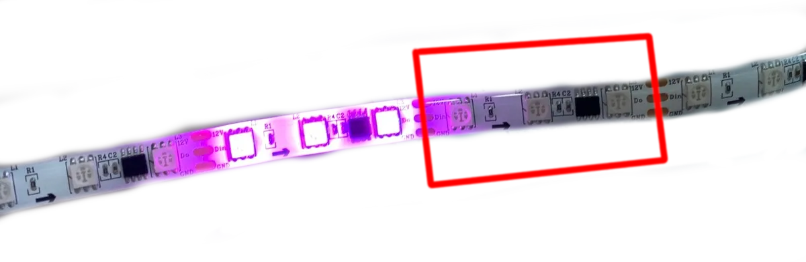
</p>

Программа автоматически спроектирует положение ленты за монитором на экран, поэтому корректность замеров напрямую влияет на правильность считывания зон захвата для каждого блока светодиода.

Строго следуйте пунктам ниже, для корректной настройки.

### 2.1. Размеры монитора

Размеры монитора заполняются в таблице `[screen_config]`.

Необходимо снять размеры дисплея (поверхность, что способна отображать картинку) без пластмассовых/металлических рамок. Потребуются высота и ширина экрана в миллиметрах. Пример того, как именно снять размеры с экрана проиллюстрирован на рисунке ниже:

<p align="center">
  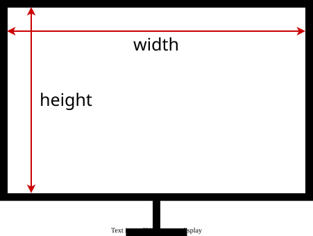
</p>

Полученные значения вносятся в соответствующие блоки `frame_width_mm` для ширины и `frame_height_mm` для высоты.

Пример заполнения таблицы:
```toml
[screen_config]
frame_width_mm = 590
frame_height_mm = 330
```

После снятия размеров экрана можно приступить к замерам ленты.

### 2.2. Положение ленты

Положение ленты заносится в таблицу `[led_position_config]`.

Предполагается, что лента имеет одинаковое количество светодиодов на параллельных сторонах, а также лента наклеена с одинаковым зазором от края дисплея на каждой стороне.

Необходимо измерить и вписать 4 значения:
 - `gap` - зазор от середины ленты (т.е. от физической середины самого светодиода на ленте) до края дисплея (без учёта рамок). Если лента наклеена на экран с <u>разными</u> зазорами, следует указать <u>наименьший</u>, однако учтите, что в таком случае захват зон может быть менее точным;
 - `led_length` - размер одного блока светодиода именно между местами, в которых можно произвести разрез (что такое блок светодиодов можно прочитать в начале [второго шага](#шаг-2-размеры-монитора-и-положение-ленты));
 - `vertical_led_amount` - количество блоков светодиодов на одной вертикальной стороне ленты;
 - `horizontal_led_amount` - количество блоков светодиодов на одной горизонтальной стороне ленты.

Схематичное измерение зазора `gap` изображено на рисунке ниже, где лента изображена синим цветом и намеренно увеличена.

<p align="center">
  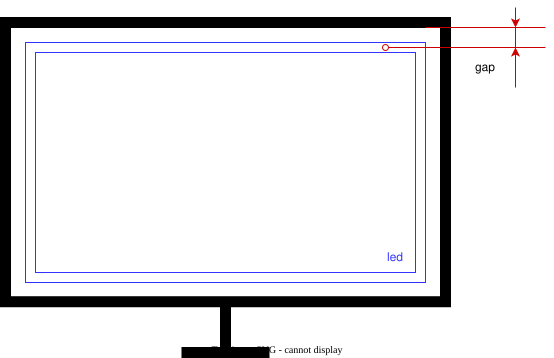
</p>

Пример заполнения таблицы:
```toml
[led_position_config]
gap = 10
led_length = 62
vertical_led_amount = 5
horizontal_led_amount = 9
```

### 2.3 Зона чтения

Также здесь стоит настроить параметры считывания, чтобы зона захвата точно совпадала с лентой.

Данная настройка сохраняется в таблице `[screen_reading_config]`. Обязательны 2 параметра:
 - `deep_in`: чтение к центру экрана (в мм);
 - `deep_out`: чтение от центра экрана (в мм. Обязательно $< gap$).

<p align="center">
  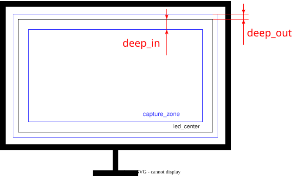
</p>

Пример заполнения таблицы:
```toml
[screen_reading_config]
deep_in = 10
deep_out = 5
```

Рекомендуемые параметры:
 - `deep_in`: ~10-20;
 - `deep_out`: ~50% от `gap`.

Рекомендуется поставить зону считывания шириной ~10-20 мм.

После замера положения ленты на мониторе и установке зоны чтения можно переходить к следующему шагу.

## Шаг 3. Подключение ленты

Теперь необходимо разобраться с подключением ленты к контроллеру и компьютеру, чтобы `shinombra` могла корректно управлять подсветкой.

### 3.1. Подключение к контроллеру

Параметры подключения ленты заносятся в таблицу `[frame_connection_config]`.

Предполагается, что лента полностью опоясывает края монитора, т.е. не имеет разрывов, а также подключается в начале одной из сторон и дальше цепочкой. Любой другой формат на данный момент, увы, не поддерживается.

**Важно:** стороны и направления определяются из положения, когда Вы смотрите <u>на экран монитора</u>, т.е. в обычном рабочем положении.

Необходимо указать 2 параметра:
 - `start_from` - сторона, которая подключена к контроллеру;
 - `direction` - направление, в котором соединены стороны ленты между собой.

Для `start_from` есть 4 варианта, соответствующих сторонам:
 - `Left`
 - `Up`
 - `Right`
 - `Down`

Для `direction` есть 2 варианта:
 - `Clockwise` - по часовой стрелке
 - `Counterclockwise` - против

Простая таблица для быстрого определения направления (снова смотрим именно **на** дисплей):
| Сторона ленты, к которой подключен контроллер | Откуда видно провод, идущий к контроллеру |     direction      |
| :-------------------------------------------: | :---------------------------------------: | :----------------: |
|                     Лево                      |                    Низ                    |    `Clockwise`     |
|                     Лево                      |                   Верх                    | `Counterclockwise` |
|                     Верх                      |                   Лево                    |    `Clockwise`     |
|                     Верх                      |                   Право                   | `Counterclockwise` |
|                     Право                     |                   Верх                    |    `Clockwise`     |
|                     Право                     |                    Низ                    | `Counterclockwise` |
|                      Низ                      |                   Право                   |    `Clockwise`     |
|                      Низ                      |                   Лево                    | `Counterclockwise` |

Пример заполнения таблицы для ленты, подключённой слева-снизу (т.е. по часовой стрелке), как на картинке ниже:
```toml
[frame_connection_config]
start_from = "Left"
direction = "Clockwise"
```

<p align="center">
  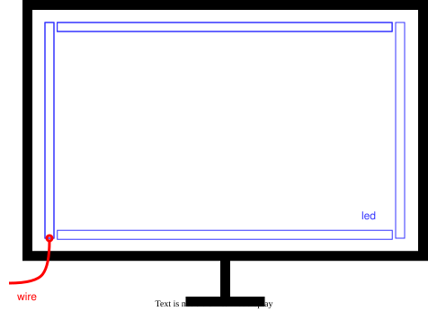
</p>

После указания подключения можно переходить к настройке протоколов связи с ПК.

### 3.2. Подключение к ПК

Данная настройка указывается в таблице `[settings]` в поле `hardware_output_type`. Об остальных полях данной таблицы подробно написано в [разделе о конфигурации](#settings).

На данный момент лента поддерживает ограниченное число протоколов, а именно:
 - [DDP](#ddp-ddp_config);
 - [DRGB](#drgb-wled_drgb_config);
 - [ShinombraSerial](#shinombraserial-shinombra_serial_config) - кастомный протокол, о котором подробнее написано в [разделе о кастомном протоколе](#shinombraserial-1);
 - [Debug](#debug) - отладочный вывод в консоль.

В зависимости от протокола, который поддерживает ваше устройство, необходимо указать данные согласно одному из пунктов ниже.

#### DDP

При выборе DDP протокола необходимо указать `hardware_output_type = "Ddp"`, настройки самого протокола внести в таблицу `[ddp_config]`.

Настройка требует только одного обязательного поля `ip`, в которое можно вписать как ip-адрес, так и dns-имя.

Следующие настройки <u>не обязательны</u> и могут негативно сказаться на работе протокола. Указывайте их только, если уверены:
 - `port` - порт, на котором устройство ожидает принимать пакеты (по умолчанию выбран `4048`);
 - `mtu` - размер пакета в байтах в Вашей сети (по умолчанию `1500`). Зависит от роутера и способа подключения к сети. Необходим для корректного разбиения потока на пакеты.

Для корректной работы алгоритма рекомендуется ограничить FPS в пределах [60; 100] в зависимости от количества блоков светодиодов в Вашей ленте. Как это сделать можно прочитать в разделе [об ограничении FPS](#шаг-7-ограничение-fps).

Пример заполнения таблицы:
```toml
[settings]
hardware_output_type = "Ddp"
...

[ddp_config]
ip = "led.local"
```

#### DRGB

При выборе DRGB протокола от Wled необходимо указать `hardware_output_type = "WledDrgb"`, настройки самого протокола внести в таблицу `[wled_drgb_config]`.

Настройка требует только одного обязательного поля `ip`, в которое можно вписать как ip-адрес, так и dns-имя.

Следующие настройки <u>не обязательны</u> и могут негативно сказаться на работе протокола. Указывайте их только, если уверены:
 - `port` - порт, на котором устройство ожидает принимать пакеты (по умолчанию выбран `21324`);
 - `timeout` - максимальное время ожидания пакета устройством (по умолчанию `2`). Если в течение установленного времени пакет не пришёл, устройство принимает решение на основе внутренней программы, обычно переходит в режим ожидания.

Для корректной работы алгоритма рекомендуется ограничить FPS в пределах [60; 100] в зависимости от количества блоков светодиодов в Вашей ленте. Как это сделать можно прочитать в разделе [об ограничении FPS](#шаг-7-ограничение-fps).

Пример заполнения таблицы:
```toml
[settings]
hardware_output_type = "WledDrgb"
...

[wled_drgb_config]
ip = "led.local"
```

#### ShinombraSerial

При выборе протокола ShinombraSerial необходимо указать `hardware_output_type = "ShinombraSerial"`, настройки самого протокола внести в таблицу `[shinombra_serial_config]`. Подробнее о самом протоколе написано в [разделе о кастомном протоколе](#shinombraserial-1).

Настройка требует только двух параметров:
 - `port_path` - путь до устройства. Обычно `/dev/ttyUSBx`;
 - `baud_rate` - скорость обмена данными по Serial (подробнее читать в описании протокола).

Перед стартом, убедитесь, что Ваш пользователь есть в группе `uucp` для Arch или `dialout` для Debian.

Пример заполнения таблицы:
```toml
[settings]
hardware_output_type = "ShinombraSerial"
...

[shinombra_serial_config]
port_path = "/dev/ttyUSB0"
baud_rate = 2000000
```

#### Debug

При выборе отладочного вывода необходимо указать `hardware_output_type = "Debug"`.

Данный вариант не имеет собственных настроек. Он выводит в консоль рамку из блоков светодиодов, которые окрашены в цвет, полученный после аналитики и фильтрации. Необходим исключительно для отладки.

Для его работы Ваш терминал должен поддерживать ANSI-символы.

Пример заполнения таблицы:
```toml
[settings]
hardware_output_type = "Debug"
...
```

После настройки связи с устройством можно перейти к настройке сервиса.


## Шаг 4. Настройка сервиса

Изначально `shinombra` устанавливается как unit-сервис, однако при желании Вы можете использовать её как обычную программу, вызывая по имени в терминале.

В зависимости от выбранного режима конфигурации данные настройки должны располагаться в манифесте при сложном режиме или в файле-конфигурации при простом режиме. Подробнее об этом написано в [разделе о конфигурации](#итоговый-вид-конфига).

Настройки сервиса указываются в таблице `[daemon_settings]`

Для запуска сервиса необходимо указать следующие параметры:
 - `log_level` - уровень логирования;
 - `pipewire_conversion` - разрешение на преобразование типов силами PipeWire (подробнее об этом можно прочитать в [разделе об обработке кадра](#как-shinombra-обрабатывает-кадр));
 - `save_token` - разрешение на сохранение токена сессии PipeWire (необходимо для автоматического старта сервиса без необходимости каждый раз разрешать захват экрана).

На выбор доступно несколько уровней логирования:
 - `Off` - логи полностью отключены;
 - `Error` - только критические ошибки;
 - `Warn` - предупреждения;
 - `Info` - информация о текущем состоянии;
 - `Debug` - отладочный вывод;

Каждый уровень логов ограничивает вывод так, что выводятся логи только схожего уровня или уровня выше выбранного. Т.е. при установке `log_level = Warn` будут выводиться как предупреждения, так и критические ошибки.

Флаг `save_token` управляет сохранением токена сессии PipeWire в бинарный файл по пути `~/.local/share/shinombra/session.bin`. Токен хранится в зашифрованном виде. Он необходим, чтобы при каждом запуске сервиса не появлялось окно выбора экрана.

Пример заполнения таблицы:
```toml
[daemon_settings]
log_level = "Warn"
pipewire_conversion = false
save_token = true
```

Дальнейшие главы нужны для более точной настройки ленты и понимания внутренних процессов. Если Вам уже не терпится попробовать `shinombra` в деле, рекомендую использовать [пресеты](./presets.md).

## Как Shinombra обрабатывает кадр

Данный пункт является исключительно информативным и нужен только для большего понимания, как именно настройки будут влиять на работу программы. Однако при желании можно пропустить и сразу перейти к [следующему шагу](#шаг-5-настройка-процессора-фрагмента).

Прежде чем говорить о внутренней логике работы программы, важно ввести строгие понятия:
 - ***кадр*** - массив пикселей, который программа обрабатывает (картинка на экране целиком);
 - ***фрагмент кадра*** - часть кадра в виде прямоугольной области, которая была закреплена за конкретным [блоком светодиодов](#шаг-2-размеры-монитора-и-положение-ленты) в результате проекции;
 - ***процессор / обходчик фрагмента*** - алгоритм, который специальным образом обходит фрагмент и отправляет данные на анализ;
 - ***аналитик*** - алгоритм, который занимается только анализом цвета, полученного из процессора. В результате анализа массива цветов из фрагмента вычисляет доминирующий цвет;
 - ***форматер*** - алгоритм, который превращает набор байт в цвет в RGB формате.

Прежде чем превратиться в электрические сигналы на Вашей ленте, кадр проходит определённую обработку (упрощённая схема):
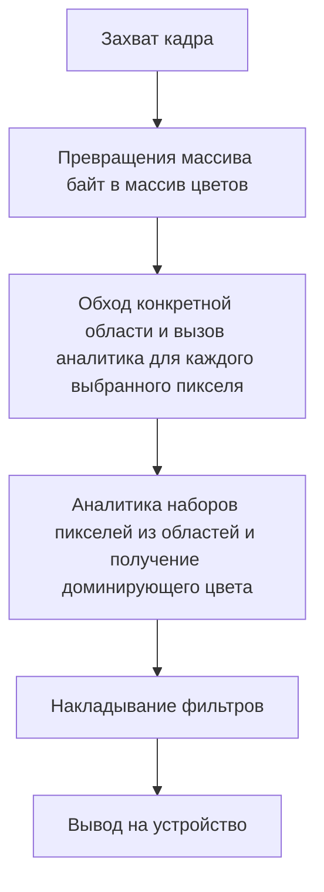

Причём обход и анализ каждого фрагмента происходит последовательно, что продиктовано архитектурными решениями. А захват происходит тогда и только тогда, когда PipeWire присылает обновлённый кадр, т.е. при смене кадра запускается обработка, если, конечно, не ограничен fps, о чём можно почитать в разделе про [ограничение fps](#шаг-7-ограничение-fps).

На данный момент программа поддерживает ограниченное число самых распространённых форматеров (все вариации RGB), однако есть вероятность, что в Вашей системе всё построено на другом формате. Именно для этого существует флаг `[daemon_settings] pipewire_conversion`, который позволяет PipeWire попробовать налету превратить формат Вашей системы, в понятный для `shinombra` вид. Однако данная настройка влечёт за собой увеличение расхода ресурсов, т.к., увы, PipeWire будет преобразовывать и копировать кадр целиком, несмотря на то, что обычно `shinombra` анализирует меньше ~10%.

Также важно сказать о том, что фильтры и аналитики могут работать в разных форматах, а именно в RGB и HSV. Для избежания лишних преобразований была создана умная обёртка, которая преобразует формат только тогда, когда это требуется. Однако важно учитывать, что от расположения фильтров зависит производительность. О том, в каком формате работает каждый фильтр можно узнать в разделе [о фильтрах](#шаг-8-настройка-фильтров) перед примером заполнения таблицы для каждого фильтра, а также в конце самого раздела.

Составив общее представление о работе программы, можно перейти к её непосредственной настройке.


## Шаг 5. Настройка процессора фрагмента

Выбор процессора указывается в таблице `[settings]` в поле `chunk_processor_type`. Подробнее об этой таблице можно почитать в [разделе о конфигурации](#settings).

На выбор есть:
 - [Checkerboard](#checkerboard) - для спокойных и размеренных видео / кино;
 - [CrawlCheckerboard](#dynamiccheckerboard) - для динамичных и резких сцен / активных игр.

О каждом варианте подробно написано в соответствующих пунктах ниже.

### Checkerboard

Обход в статичном "шахматном" порядке или в виде "сетки". Данный процессор всегда пропускает определённое количество строк и столбцов, в результате чего на анализ попадает не весь фрагмент, а малая его часть. Принцип захвата проиллюстрирован на рисунке ниже, где синим отмечены те пиксели, которые попадают в анализ.

<p align="center">
  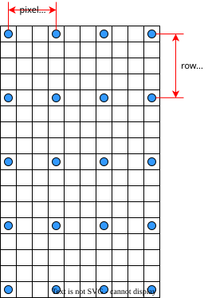
</p>

Данный процессор хорошо подходит для спокойных видео, кино, обычного скроллинга сети и подобных ситуаций, т.к. не создаёт помех и выдаёт стабильный результат. Однако важно учитывать, что из-за принципа его работы он может упускать мелкие детали.

Настройки данного процессора сохраняются в таблице `[checkerboard_config]` (не забудьте указать выбранный процессор в таблице `[settings]`). Требуется заполнить 2 параметра:
 - Каждый пиксель с "номером", кратным `pixel_step`, будет считан;
 - Каждая строка с "номером", кратным `row_stride`, будет считана.

Пример заполнения таблицы для параметров из рисунка:
```toml
[settings]
chunk_processor_type = "Checkerboard"
...

[checkerboard_config]
# Читается каждый третий пиксель в строке
pixel_step = 3
# Читается каждая четвёртая строка
row_stride = 4
```

Рекомендуемые значения:
 - `pixel_step`: ~7-12;
 - `row_stride`: ~4-6.

<u>Чем меньше</u> будут установлены значения, <u>тем больше</u> пикселей попадёт в анализ.

### CrawlCheckerboard

Данный процессор имеет схожий принцип работы, что и у [Checkerboard](#checkerboard), однако он не остаётся статическим, а постоянно сдвигает считывающую сетку с течением кадров. Принцип захвата проиллюстрирован на рисунке ниже, где синими всё также отмечены пиксели, попадающие в анализ, а серыми отмечены пиксели, которые захватывались на предыдущем кадре.

<p align="center">
  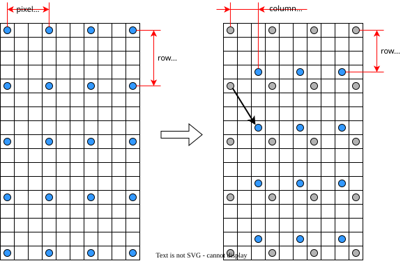
</p>

Данный процессор хорошо подходит для очень динамичных игр и кино. За счёт смещения сетки анализ получается более честным и в кадр попадают практически все пиксели (в зависимости от настройки), однако из-за этого на статичных картинках светодиоды могут моргать. Для сглаживания данного негативного эффекта рекомендуется использовать фильтры: [EMA](#ema) и [Median](#median).

Настройки данного процессора сохраняются в таблице `[crawl_checkerboard_config]` (не забудьте указать выбранный процессор в таблице `[settings]`). Требуется заполнить 4 параметра:
 - Каждый пиксель с "номером", кратным `pixel_step`, будет считан;
 - Каждая строка с "номером", кратным `row_stride`, будет считана;
 - `column_crawl` - число столбцов, на которое сместится сетка;
 - `row_crawl` - число строк, на которое сместится сетка.

Пример заполнения таблицы для параметров из рисунка:

```toml
[settings]
chunk_processor_type = "CrawlCheckerboard"
...

[crawl_checkerboard_config]
# Читается каждый третий пиксель в строке
pixel_step = 3
# Читается каждая четвёртая строка
row_stride = 4
# На следующем кадре сетка сместится на 2 столбца
column_crawl = 2
# На следующем кадре сетка сместится на 3 строки
row_crawl = 3
```

Рекомендуемые значения:
 - `pixel_step`: ~7-12;
 - `row_stride`: ~4-6;
 - `column_crawl`: ~1-5;
 - `row_crawl`: ~1-5.

Здесь, аналогично [Checkerboard](#checkerboard), <u>чем меньше</u> будут установлены значения, <u>тем больше</u> пикселей попадёт в анализ. Также для избежания моргания светодиодов не рекомендуется ставить параметры смещения сетки на слишком большие значения и не имеет смысла ставить `column_crawl = pixel_step` или `row_crawl = row_stride`. Это не сломает логику работы программы, но и не даст никакой пользы.


## Шаг 6. Настройка аналитика

Выбор аналитика указывается в таблице `[settings]` в поле `analytics_type`. Подробнее об этой таблице можно почитать в [разделе о конфигурации](#settings).

На выбор есть:
 - [Average](#average) - менее точный, но более производительный;
 - [Histogram](#histogram) - максимально точный, но менее производительный;
 - [DebugRgb](#debugrgb) - для отладки.

О каждом варианте подробно написано в соответствующем пункте ниже.

### Average

Простейшее среднее арифметическое. Для полученных пикселей вычисляется среднее значение по каналам red, green и blue.

Данный алгоритм является максимально простым и сверх дешёвым по производительности. Однако большим его минусом является то, что он не вычисляет доминирующий цвет как таковой. Например, если на чёрной сцене попадётся белая линия, то алгоритм выдаст серый цвет.

Ниже представлены примеры работы на различных изображениях. Первым идёт исходное изображение, а затем за ним идёт то же полупрозрачное изображение с наложенными значениями блоков светодиодов (без фильтров): 

<p align="center">
  
  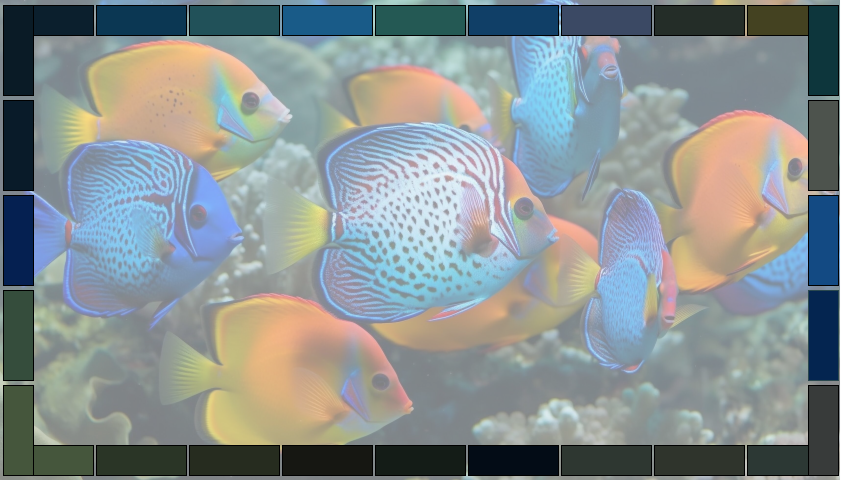
  
  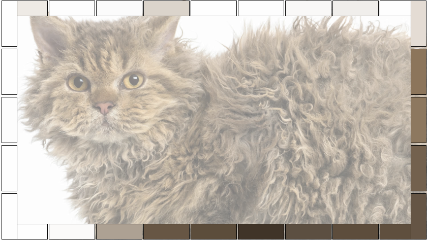
</p>

\* изображённые блоки имеют намеренно гиперболизированный размер и в реальности в ~2 раза тоньше.

Среднее арифметическое не имеет своего поля с настройками.

Пример заполнения таблицы:
```toml
[settings]
analytics_type = "Average"
...
```

### Histogram

Алгоритм расчёта доминирующего цвета на взвешенных гистограммах является одним из самых точных для определения доминирующего цвета. Он работает на системе голосования в пространстве HSV. Цветовой круг разбивается на условные зоны для голосования. Каждый пиксель, попавший в анализ, голосует за определённый участок на круге. Голосом служит произведение яркости на насыщенность, т.к. человеческий глаз видит более насыщенные и яркие цвета куда лучше и "доминантнее", чем тусклые и тёмные. Если пиксель тусклый, он голосует за отдельную выбранную корзину, необходимую для чёрного и белого цветов. При вычислении доминирующего цвета находится корзина с бОльшим количеством голосов, цвет тон берётся как середина участка круга, насыщенность и яркость как среднее по пикселям, голосовавшим за победившую корзину.

Данный алгоритм является очень точным, однако требует куда больше ресурсов чем [Average](#average). Зато результат получается максимально точным.

Ниже представлены примеры работы на различных изображениях. Первым идёт исходное изображение, а затем за ним идёт то же полупрозрачное изображение с наложенными значениями блоков светодиодов (без фильтров): 

<p align="center">
  
  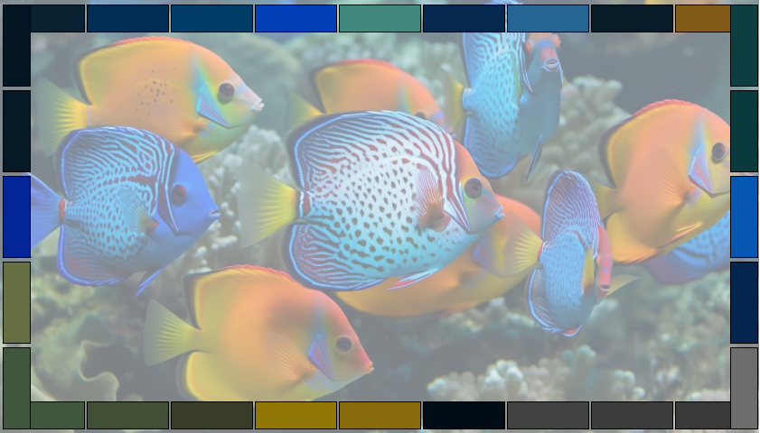
  
  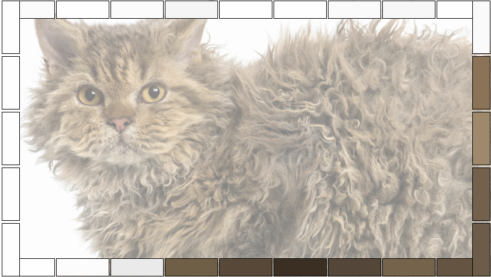
</p>

\* изображённые блоки имеют намеренно гиперболизированный размер и в реальности в ~2 раза тоньше. Вычисления производились на максимальном уровне точности.

Для данного алгоритма можно выбрать точность работы с помощью настройки `precision_level` в таблице `[histogram_config]`. Уровень точности ограничен [1; 20]. Результирующее количество корзин $= precision\_level \cdot 6$. Т.е. при установки `precision_level = 20` Вы получите анализ на 120 корзинах, что очень точно, т.к. на каждый участок для голосования выходит всего 3 градуса круга, что человеческий глаз практически не различает.

Пример заполнения таблицы:
```toml
[settings]
analytics_type = "Histogram"
...

[histogram_config]
precision_level = 20
```

Выбранная точность напрямую влияет на производительность. <u>Чем больше</u> точность, <u>тем больше</u> затрачивается ресурсов.

### DebugRgb

Это отладочный вывод. Подойдёт, если Вы хотите настроить точность отображения цвета и залить всю ленту одним цветом.

Данный вариант ничего не вычисляет и только выдаёт цвет из конфигурации.

Конфигурация хранится в таблице `[debug_rgb_config]` и имеет 3 параметра: `red`, `green` и `blue` соответствующие обычному RGB пикселю. Данные значения ограничены в пределах [0; 255].

Пример заполнения таблицы:
```toml
[settings]
analytics_type = "DebugRgb"
...

[debug_rgb_config]
red = 50
green = 50
blue = 50
```

После выбора аналитика можно настроить ограничение по FPS.


## Шаг 7. Ограничение FPS

В связи с тем, что некоторые протоколы не поддерживают передачу данных выше определённых значений FPS, а также в среднем человеческое боковое зрение не способно заметить разницу между обновлением картинки с частотой 60 Гц и любой другой выше, `shinombra` способна ограничивать частоту кадров на уровне захвата кадров, просто отсеивая тех, кто пришёл не вовремя.

Данная настройка вносится в таблицу `[settings]` в поле `max_fps`. Подробнее об этой таблице можно почитать в [разделе о конфигурации](#settings).

Ограничение частоты является опциональным. Вы можете установить ограничение на любое натуральное значение больше нуля, либо не ограничивать вообще.

Пример заполнения таблицы:
```toml
[settings]
max_fps = 60
...
```

После ограничения FPS можно перейти к настройке фильтрации.

## Шаг 8. Настройка фильтров

Из-за того, что цветопередача на мониторе и на светодиодной ленте обычно не совпадает, а также Вы можете сидеть напротив не идеально белой стены, а цветных обоев, `shinombra` поддерживает богатую систему фильтрации, обеспечивающую Вас красивой, настраиваемой картинкой.

Все фильтры заполняются в таблицу `[settings]` в поле `filter_chain` в виде массива в том порядке, в котором необходимо их применить слева на право.

Пример для последовательной фильтрации `EMA -> WhiteBalance -> Gamma`:
```toml
[settings]
filter_chain = ["Ema", "WhiteBalance", "Gamma"]
...
```

Важно понимать, что фильтры можно располагать в любом порядке и дублировать, однако настройка для конкретного фильтра может быть всего 1 в соответствующем поле. Например, нельзя добавить в цепочку 2 EMA фильтра с разными `alpha` - это не поддерживает система конфигурации.

На выбор есть:
 - [NoFilter](#nofilter) - отсутствие фильтра;
 - [Ema](#ema) - делает изменение картинки более плавным;
 - [Gamma](#gamma) - корректирует яркость под человеческое восприятие;
 - [BlackThreshold](#blackthreshold) - умное отсечение тусклых цветов (через кусочную функцию);
 - [SaturationBoost](#saturationboost) - умное увеличение насыщенности;
 - [WhiteBalance](#whitebalance) - настройка баланса белого (теплота в кельвинах);
 - [ChannelGain](#channelgain) - точная регулировка каналов;
 - [FlashGuard](#flashguard) - защита от вспышек;
 - [Median](#median) - защита от случайных выбросов.

О каждом фильтре подробно написано в соответствующих пунктах ниже.

Для правильности понимания формул важно сразу обозначить диапазоны форматов представления:
 - **RGB**:
   - red: [0; 255]
   - green: [0; 255]
   - blue: [0; 255]
 - **HSV**:
   - hue: [0; 1]
   - saturation: [0; 1]
   - value: [0; 255]

\* данные диапазоны были выбраны для удобства работы и понимания автора

### NoFilter

Полное отсутствие фильтра. Требуется, если Вам в целом не нужна фильтрация данных.

Пример заполнения таблицы:
```toml
[settings]
filter_chain = ["NoFilter"]
...
```

### EMA

EMA (экспоненциальное скользящее среднее) - это фильтр, необходимый для сглаживания резкой картинки. Он не даёт картинке измениться мгновенно, а слегка разглаживает пик изменения во времени, в результате чего картинка выглядит мягче и плавнее. Для расчёта каждого канала используется формула:

$$C_{out} = C_{in} \cdot \alpha + C_{prev} \cdot (1 - \alpha)$$

где:
 - $C_{in}$ - значение из канала (каждого из RGB отдельно), прешедшее в фильтр;
 - $C_{prev}$ - предыдущее значение канала, которое фильтр отдал;
 - $C_{out}$ - результат по каналу.

Данный фильтр имеет настройки в таблице `[ema_config]`. Единственный параметр `alpha` отвечает за то, насколько сильно новый цвет влияет на изменение, поэтому данный коэффициент ограничен в диапазоне $(0; 1]$. <u>Чем меньше</u> `alpha`, <u>тем более</u> плавной становится картинка.

Также важно понимать, что EMA напрямую зависит от значения FPS. <u>Чем меньше</u> FPS, <u>тем больше</u> EMA сгладит картинку при одинаковом `alpha`.

<p align="center">
  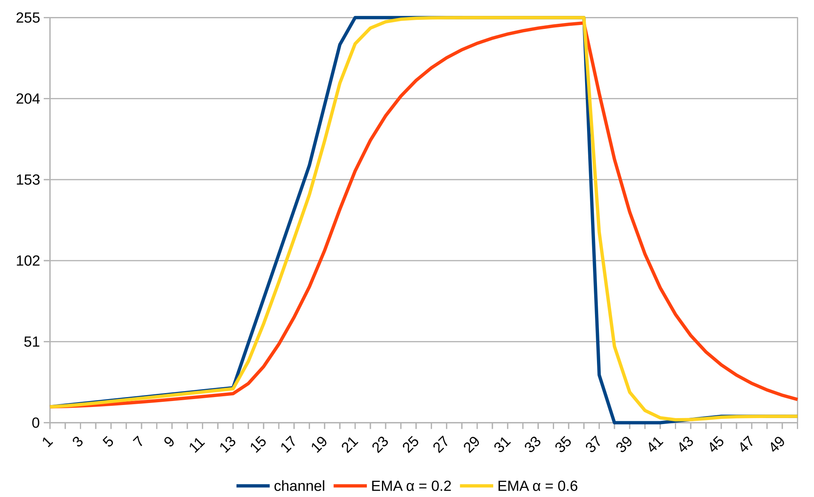
</p>

EMA работает в RGB пространстве.

Пример заполнения таблицы:
```toml
[settings]
filter_chain = [..., "Ema", ...]
...

[ema_config]
alpha = 0.1
```

Рекомендуемые параметры:
 - Для динамичных игр `alpha`: 0.4-0.6 при FPS ~60;
 - Для спокойного кино `alpha`: 0.2-0.5 при FPS ~60.

### Gamma

Gamma - это стандартный фильтр, призванный корректировать изменения яркости, согласно строению человеческого глаза. В результате эволюции человек научился различать разницу в тусклом цвете сильнее, чем в ярком, т.е. изменение яркости ($[0; 255]$) $0 \to 1$ будет заметно сильнее, чем $254 \to 255$, поэтому gamma превращает результаты анализа кадра в приятные для человека цвета, используя степенную функцию (для нормированной яркости. Т.е. диапазон $[0; 1]$): 

$$V_{out} = V_{in}^{\gamma}$$

где:
 - $V_{in}$ - яркость, пришедшая в фильтр;
 - $V_{out}$ - результат по яркости.

Данный фильтр имеет настройки в таблице `[gamma_config]`. Единственный параметр `gamma` отвечает за "крутизну" кривой преобразования яркости. <u>Чем больше</u> степень, <u>тем более</u> крутая выйдет кривая. Для настройки можно использовать простое правило: "если картинка по ощущению темнее, чем лента, значит `gamma` следует поднять. В ином случае опустить". Данный параметр ограничен в диапазоне $[0; \infty)$.

<p align="center">
  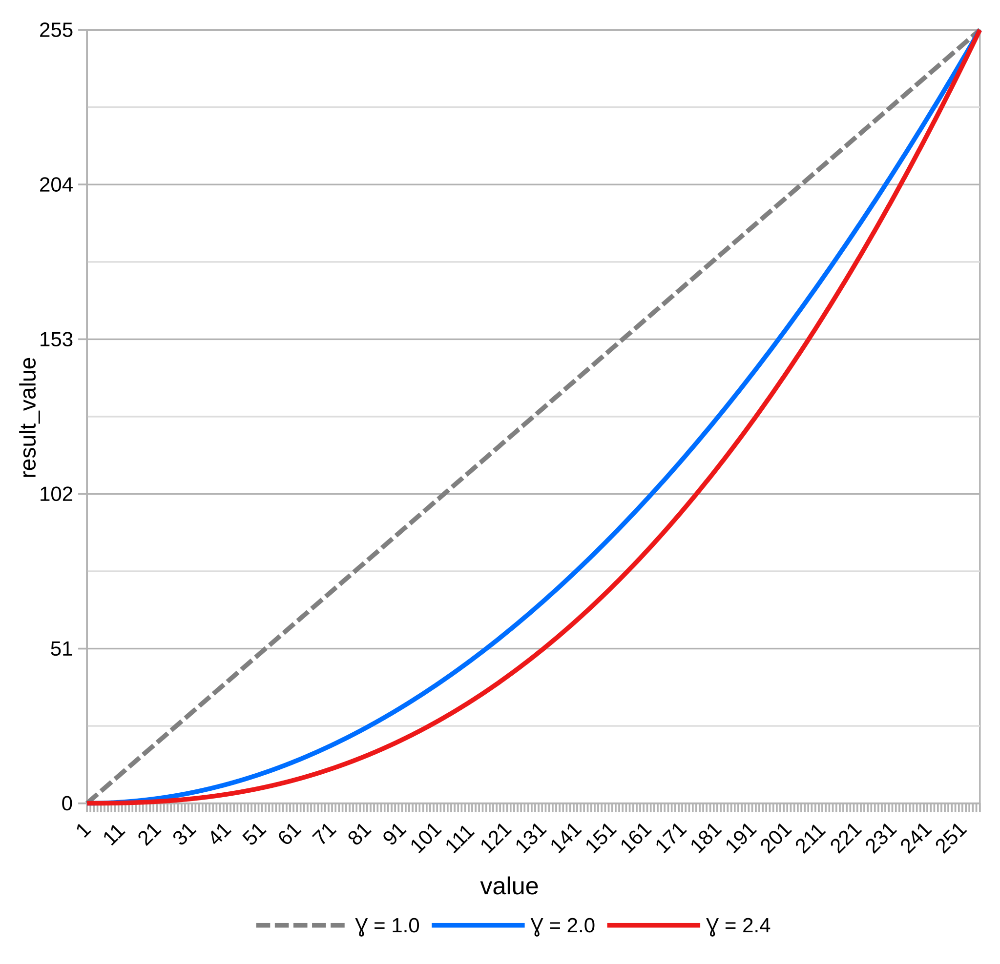
</p>

Gamma работает в RGB пространстве.

Пример заполнения таблицы:
```toml
[settings]
filter_chain = [..., "Gamma", ...]
...

[gamma_config]
gamma = 2.2
```

Рекомендуемые параметры:
 - Для большинства светодиодных лент `gamma`: ~2.0-2.4.

### BlackThreshold

BlackThreshold - отсекатель тусклого - необходим для отсечения цветов, близких в чёрному. Принцип его работы перекликается с [Gamma-фильтром](#gamma), однако отсекатель позволяет регулировать поведение `shinombra` более точно, ведь работает на определённом участке. Также он позволяет создавать зону с более плавным изменением яркости и насыщенности, о чём более подробно написано ниже. Вычисления производятся по формуле:

$$
\begin{cases}  
V_{out} = 0, \quad S_{out} = 0 & \text{если } V_{in} < V_{threshold} \\
V_{out} = V_{in} \cdot (k(V_{in}))^{\mathit{falloff\_exponent}} & \text{если } V_{threshold} \le V_{in} < V_{threshold} + V_{fade\_range} \\
S_{out} = S_{in} \cdot k(V_{in}) & \text{если } V_{threshold} \le V_{in} < V_{threshold} + V_{fade\_range} \\
V_{out} = V_{in}, \quad S_{out} = S_{in} & \text{если } V_{in} \ge V_{threshold} + V_{fade\_range}
\end{cases}
$$

$$
\begin{aligned}
V_{threshold} &= \frac{threshold \cdot 255}{100} \\
V_{fade\_range} &= \frac{fade\_range \cdot 255}{100} \\
k &= \frac{V_{in} - V_{threshold}}{V_{fade\_range}}
\end{aligned}
$$

где:
 - $V_{in}$ - яркость, пришедшая в фильтр;
 - $S_{in}$ - насыщенность, пришедшая в фильтр;
 - $V_{out}$ - результат по яркости;
 - $S_{out}$ - результат по насыщенности.

Настройки данного фильтра хранятся в `[black_threshold_config]`. Необходимо указать 3 параметра:
 - `threshold` - минимальный порог яркости, до которого все цвета считаются чёрными (в диапазоне $[0; 100]\%$);
 - `fade_range` - ширина диапазона после минимального порога, в которой работает плавное изменение цвета (в диапазоне $[0; 100 - threshold]\%$);
 - `falloff_exponent` - "крутизна" кривой, работающей в диапазоне (в диапазоне $[0; \infty)$ математически, но смысл имеет при значениях больше 1).

\* В формулах, конечно, `threshold` и `fade_range` переводятся в соответствующий диапазон.

<p align="center">
  
</p>

Ниже представлены графики воздействия при `threshold = 10%`, `fade_range = 10%`, `falloff_exponent = 1.5`:
<p align="center">
  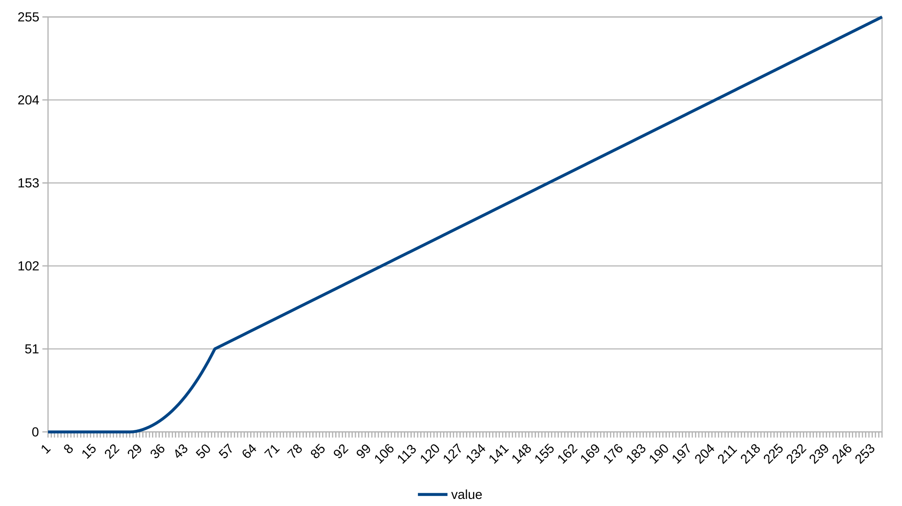
  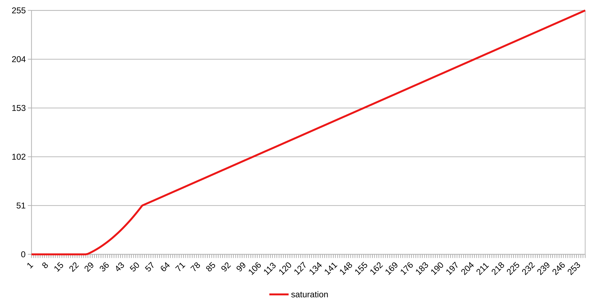
</p>

BlackThreshold работает в HSV пространстве.

Пример заполнения таблицы:
```toml
[settings]
filter_chain = [..., "BlackThreshold", ...]
...

[black_threshold_config]
threshold = 6
fade_range = 10
falloff_exponent = 1.5
```

Рекомендуемые параметры:
- `threshold`: 5-15%;
- `fade_range`: 5-15%;
- `falloff_exponent`: 1.2-2.0.

### SaturationBoost

SaturationBoost - это фильтр, необходимый для увеличения насыщенности полученного цвета. Он компенсирует падение насыщенности, вызванное физическими свойствами и условиями расположения ленты. При прохождении через рассеиватель, а также при отражении от стены свет теряет насыщенность. Для корректировки используется формула:

$$
\begin{cases}
S_{out} = 0 & \text{если } S_{in} < S_{floor} \quad \text{(полное отсечение)} \\
S_{out} = \left(\frac{S_{in} - S_{floor}}{1 - S_{floor}}\right)^{\mathit{boost\_exponent}} & \text{если } S_{in} \ge S_{floor} \quad \text{(плавное увеличение)}
\end{cases}
$$

$$
S_{floor} = \frac{floor}{100} \quad \text{(перевод из процентов)}
$$

где:
 - $S_{in}$ - насыщенность, пришедшая в фильтр;
 - $S_{out}$ - результат по насыщенности.

Настройки данного фильтра хранятся в таблице `[saturation_boost_config]` и требуют указания 2-ух параметров:
 - `floor` - порог, ниже которого насыщенность приводится к 0 (в диапазоне $[0; 100)\%$);
 - `boost_exponent` - "крутизна" кривой, по которой увеличивается насыщенность (в диапазоне $[1; \infty)$ ).

Ниже представлен график воздействия при `floor = 10%`, `boost_exponent = 1.5`:
<p align="center">
  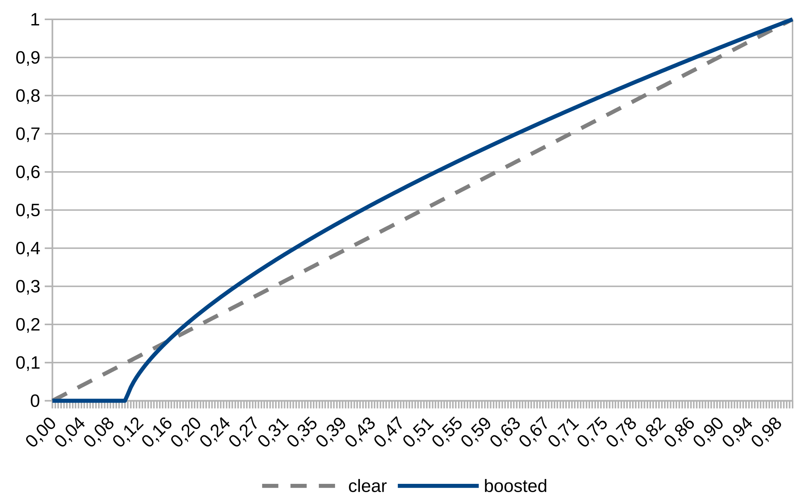
</p>

SaturationBoost работает в HSV пространстве.

Пример заполнения таблицы:
```toml
[settings]
filter_chain = [..., "SaturationBoost", ...]
...

[saturation_boost_config]
floor = 3
boost_exponent = 1.6
```

Рекомендуемые параметры:
 - `floor`: 7-12%;
 - `boost_exponent`: 1.4-1.8.

### WhiteBalance

WhiteBalance - баланс белого - требуется для коррекции цветового тона ленты, т.к. обычно синие светодиоды для человека кажутся ярче, поэтому картинка становится холоднее.

Настройки данного фильтра хранятся в таблице `[white_balance_config]`. Требуется указать единственный параметр `kelvins` - обычная теплота в кельвинах. Кельвины должны быть строго больше 1000К, что является ограничением используемого алгоритма Таннера-Хеллэнда. Также в связи с использованием данного алгоритма цвета корректно регулируются в пределах ~ $[1000; 20000]K$ (это математическое ограничение от аппроксимации), однако Вы можете ввести значение и больше 20000, т.к. математика от этого не сломается.

Данный фильтр работает в RGB пространстве.

Пример заполнения таблицы:
```toml
[settings]
filter_chain = [..., "WhiteBalance", ...]
...

[white_balance_config]
kelvins = 4000
```

Рекомендуемые значения:
 - `kelvins`: ~3500-4500 (сильно зависит от конкретной ленты и предпочтений).

### ChannelGain

ChannelGain - это точная регулировка выходных каналов. Фильтр позволяет задать коэффициенты для каждого из RGB канала. Может потребоваться в исключительных случаях, например, если у Вашей ленты один из каналов ярче остальных. Работает просто умножая канал на заданный коэффициент:

$$
  R_{out} = R_{in} * k\_red \\
  G_{out} = G_{in} * k\_green \\
  B_{out} = B_{in} * k\_blue \\
$$

где:
 - $x_{in}$ - значение из канала (каждого из RGB отдельно), прешедшее в фильтр;
 - $x_{out}$ - результат по каналу.

Настройки хранятся в таблице `[channel_gain_config]`. Обязательные 3 параметра:
 - `k_red`: коэффициент для красного цвета (в диапазоне $[0; 1]$);
 - `k_green`: коэффициент для зелёного цвета (в диапазоне $[0; 1]$);
 - `k_blue`: коэффициент для синего цвета (в диапазоне $[0; 1]$).

Данный фильтр работает в RGB пространстве.

Пример заполнения таблицы:
```toml
[settings]
filter_chain = [..., "ChannelGain", ...]
...

[channel_gain_config]
k_red = 1.0
k_green = 0.7
k_blue = 0.91
```

### FlashGuard

FlashGuard - это защитник от вспышек. Он **не** обрезает яркость, а использует EMA сглаживание для яркости, если она выходит за допустимый предел. Т.е. он не притупляет вспышку, а растягивает её во времени и делает более плавной. Для работы используется формула ниже:

$$
\begin{cases}
D = V_{in} - V_{prev} \quad \text{(разница с предыдущим значением)} \\
V_{out} = V_{prev} + \frac{\alpha}{1 + \left(\frac{|D|}{S}\right)^2} \cdot D \quad \text{(результат)}
\end{cases}
$$

$$
S = \frac{sensitivity \cdot 255}{100} \quad \text{(перевод из процентов)}
$$

Настройки данного фильтра хранятся в таблице `[flash_guard_config]`. Требуется заполнить 2 значения:
 - `alpha` - "плавность" сглаживания, как в [EMA-фильтре](#ema) (в диапазоне $[0; 1]$);
 - `sensitivity` - разница при которой срабатывает фильтр, т.е. чувствительность (в диапазоне $[0; 100]\%$). <u>Чем больше</u> `sensitivity`, <u>тем более</u> резкие вспышки будут сглаживаться, т.е. при `sensitivity = 50%` будут сглаживаться вспышки с разницей более чем в половину от максимальной яркости. Но также важно понимать, что фильтр в целом всегда сглаживает вспышки, только меньшие вспышки сглаживаются слабее (динамический alpha для EMA).

Ниже представлен график воздействия при `alpha = 0.5`, `sensitivity = 50%`:
<p align="center">
  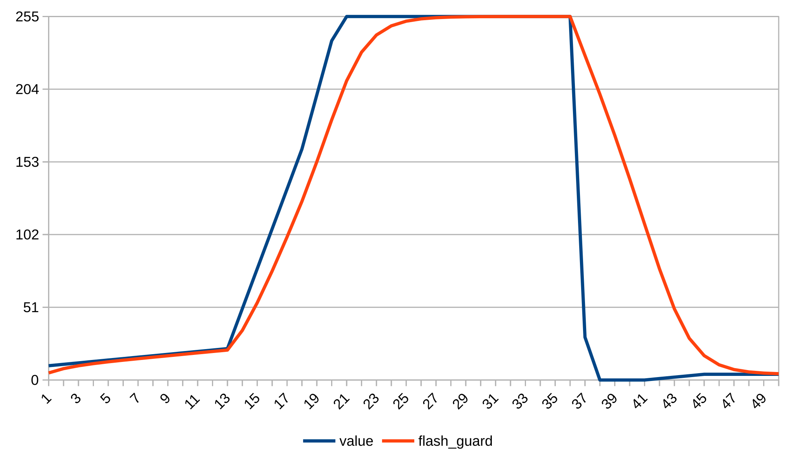
</p>

Данный фильтр работает в HSV пространстве.

Пример заполнения таблицы:
```toml
[settings]
filter_chain = [..., "FlashGuard", ...]
...

[flash_guard_config]
alpha = 0.5
sensitivity = 40
```

Рекомендуемые значения:
 - `alpha`: 0.5-0.8;
 - `sensitivity`: 50-80%.

### Median

Median - простой медианный фильтр - необходим для сглаживания резких случайных выбросов. Выступает в роли защиты от мерцания, необходимой для некоторых аналитиков. Данная реализация сделана на жёстком окне из 3-ёх элементов, что позволяет не задерживать изменение картинки слишком долго, и эффективно удалять случайные сработки.

Данный фильтр не имеет настроек.

Ниже представлен пример воздействия:
<p align="center">
  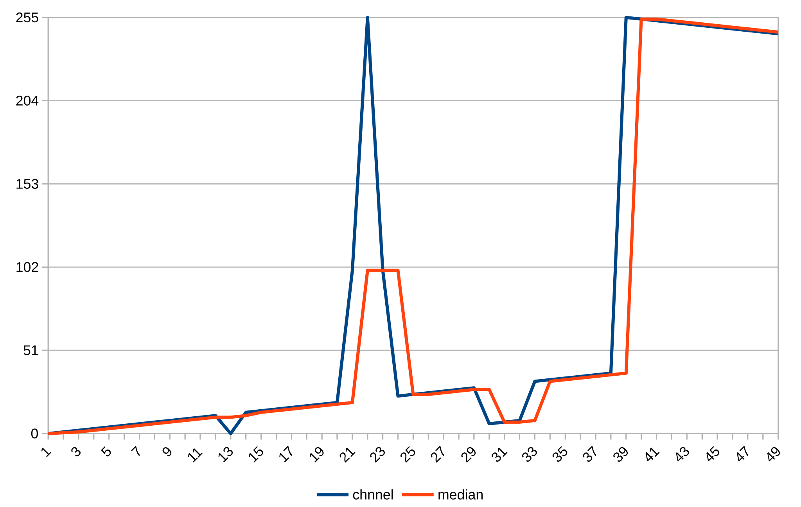
</p>

Данный фильтр работает в RGB пространстве.

Пример заполнения таблицы:
```toml
[settings]
filter_chain = [..., "Median", ...]
...
```

---

Вот маленькая табличка по пространствам, в которых работает каждый фильтр для любителей выжать из системы максимальную производительность:
|               Фильтр                | Пространство |
| :---------------------------------: | :----------: |
|        [NoFilter](#nofilter)        |     RGB      |
|             [EMA](#ema)             |     RGB      |
|           [Gamma](#gamma)           |     RGB      |
|  [BlackThreshold](#blackthreshold)  |     HSV      |
| [SaturationBoost](#saturationboost) |     HSV      |
|    [WhiteBalance](#whitebalance)    |     RGB      |
|     [ChannelGain](#channelgain)     |     RGB      |
|      [FlashGuard](#flashguard)      |     HSV      |
|          [Median](#median)          |     RGB      |


Рекомендуемый порядок фильтров:
 1) [BlackThreshold](#blackthreshold) - сразу отсекает тусклые цвета;
 2) [SaturationBoost](#saturationboost) - увеличивает насыщенность;
 3) [FlashGuard](#flashguard) - чистит вспышки;
 4) [Median](#median) - удаляет выбросы;
 5) [Ema](#ema) - сглаживает картинку;
 6) [WhiteBalance](#whitebalance) - корректирует готовую картинку по теплоте;
 7) [Gamma](#gamma) - адаптирует яркость.

```toml
[settings]
filter_chain = ["BlackThreshold", "SaturationBoost", "FlashGuard", "Median", "Ema", "WhiteBalance", "Gamma"]
...
```

Поздравляю, теперь подсветка полностью настроена! 🎉

Следующие главы подробнее раскроют принципы использования UI и TUI, а также расскажут, как в итоге должна выглядеть полная конфигурация.


## Итоговый вид конфига

В зависимости от выбранного режима конфигурации она будет выглядеть по разному. Подробно о каждом варианте написано в соответствующих пунктах ниже.

### Settings
Сразу важно сказать про таблицу `[settings]`, т.к. она нигде ещё не была описана целиком.

Данная таблица содержит настройки всего конвеера обработки цвета и содержит:
 - `chunk_processor_type` - [тип процессора](#шаг-5-настройка-процессора-фрагмента);
 - `analytics_type` - [тип аналитика](#шаг-6-настройка-аналитика);
 - `filter_chain` - [массив фильтров](#шаг-8-настройка-фильтров);
 - `hardware_output_type` - [тип вывода на устройство](#32-подключение-к-пк);
 - `max_fps` - опционально [ограничение fps](#шаг-7-ограничение-fps).

Пример заполнения:
```toml
[settings]
chunk_processor_type = "CrawlCheckerboard"
analytics_type = "Histogram"
filter_chain = ["BlackThreshold", "SaturationBoost", "FlashGuard", "Median", "Ema", "WhiteBalance", "Gamma"]
hardware_output_type = "ShinombraSerial"
```

### Простая

При выборе простой конфигурации <u>все</u> настройки содержатся в одном файле, это значит, что он должен содержать обязательные таблицы:
 - `[daemon_settings]`;
 - `[settings]`;
 - `[screen_config]`;
 - `[frame_connection_config]`;
 - `[screen_reading_config]`.

А также остальные необходимые таблицы в зависимости от выбранных настроек.

**Важно!** При простом режиме работы необходимо добавить флаг `--config <path/to/file>` в файл окружения (~/.config/shinombra/service.env) или напрямую в сервис, т.к. по умолчанию программа работает со сложным режимом конфигурации. 

### Сложная

При выборе сложной конфигурации `shinombra` начинает собирать пути из разных файлов:

#### 1. Manifest

Манифест - это точка сбора всей конфигурации. Содержит 2 таблицы:
 - `[paths]` - пути до конфигурации. Поля:
   - `config` - основной файл конфигурации;
   - `overlays` - массив путей до всех оверлеев.
 - `[daemon_settings]` - таблица с [настройками сервиса](#шаг-4-настройка-сервиса).

Пример заполнения манифеста:
```toml
[paths]
config = "configs/usual.toml"
overlays = ["overlays/gaming.toml", "overlays/night.toml"]

[daemon_settings]
log_level = "Error"
pipewire_conversion = false
save_token = true
```

#### 2. Base config

Основной конфиг - это место, где Вы можете хранить любую конфигурацию, описанную в шагах выше.

#### 3. Overlays

Оверлеи - это слои, которые будут перекрывать собранную конфигурацию. Вам не обязательно заполнять таблицы целиком, достаточно заполнить только поле, которое необходимо переписать.

Допустим в основном конфиге содержится таблица:
```toml
[frame_connection_config]
start_from = "Up"
direction = "Clockwise"
```

А в оверлее:
```toml
[frame_connection_config]
start_from = "Down"
```

Тогда в результате получим таблицу:
```toml
[frame_connection_config]
start_from = "Down"
direction = "Clockwise"
```

Оверлеи накладываются в порядке записи. Учитывайте это, т.к. оверлеи могут накладываться друг на друга.

---

`Shinombra` по умолчанию работает в режиме сложной конфигурации и ищет манифест по пути ~/.config/shinombra/manifest.toml. Если Вы хотите явно указать путь до своего манифеста, добавьте в файл окружения (~/.config/shinombra/service.env) флаг `--manifest <path/to/file>`.


## UI

Пользовательский интерфейс выполнен в виде простого сайта, который позволяет удобно заполнить поля настроек. В зависимости от выбранных опций интерфейс будет показывать структуры, необходимые для заполнения.

Для запуска интерфейса выполните в терминале:
```bash
shinombra-ui
```
И перейдите по ссылке, которую получите в выводе. Обычно вывод выглядит так:
```
Server running on http://localhost:3000
```

При запуске Вы увидите окно, которое предложит ввести путь до файла конфигурации. Если вы хотите пропустить этот шаг, запускайте UI командой:
```bash
shinombra-ui --config <path/to/config>
```

В самом низу расположены 3 кнопки: 
 1) `Set Simple Mode in Service` - автоматическая запись необходимых флагов в файл окружения для переключения `shinombra` в режим простой конфигурации. Требуется нажать при первом запуске;
 2) `Restart Service` - быстрый перезапуск сервиса. Необходим для применения новых сохранённых настроек;
 3) `Save Settings` - сохранение настроек в открытый файл

Если Вам необходимо запустить сервер на другом порту, воспользуйтесь флагом `--port <port>`.

<details>
  <summary>Нажмите, чтобы посмотреть внешний вид конфигурации</summary>
  <image src="./manual/ui.png">
</details>


## TUI

TUI является bash-скриптом, основанным на `yq` и `gum`. Он выполняет роль удобного редактора манифеста для быстрого переключения конфигурации в сложном режиме.

Для запуска выполните:
```bash
shinombra-tui
```

С помощью TUI можно:
1) выбрать [основной конфиг](#2-base-config);
2) выбрать [оверлеи](#3-overlays);
3) перезапустить сервис;

Если TUI обнаружит в стандартном файле окружения (~/.config/shinombra/service.env) флаг `--config`, активирующий простой режим конфигурации, скрипт предложит удалить данный флаг.


## ShinombraSerial

ShinombraSerial - это простой кастомный протокол, использующий для передачи данных Serial порт.

Пакет данных в данном протоколе представляет из себя последовательности из синхрослова `AD` (AmbientData) и массива данных в  RGB формате:
| Синхрослово |  R_1  |  G_1  |  B_1  |  R_2  |  G_2  |  B_2  |  ...  |
| :---------: | :---: | :---: | :---: | :---: | :---: | :---: | :---: |
|     AD      | data  | data  | data  | data  | data  | data  |  ...  |
 
Было решено не делать проверочных сумм и прочего, т.к. вероятность помехи в коротком проводе на Serial протоколе $\to 0$.

Протокол основан на простой последовательности синхронизирующих сигналов. При стандартной отправке компьютер ждёт от контроллера сигнал о готовности `[READY]` и, получив его, отправляет пакет данных:
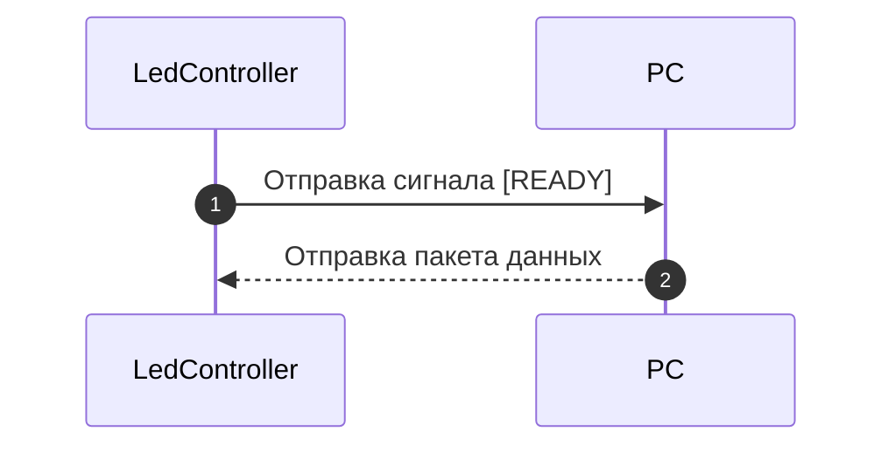

Если же ПК не прислал пакет данных, контроллер будет повторять свой запрос пока пакет не будет прислан.
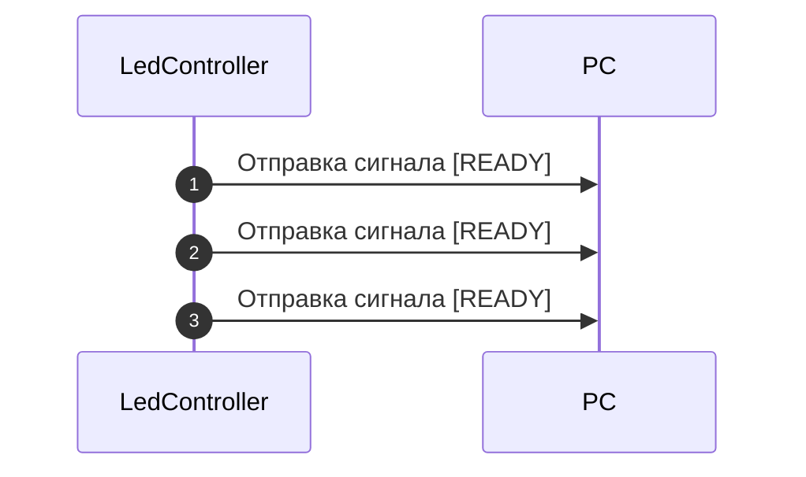

Для корректного завершения работы протокол поддерживает сигнал `[TERM]`, который заставляет контроллер выключить ленту. Однако после этого сигнала контроллер не прекратит слать `[READY]`, что сделано для удобства использования (не требуется перезапускать контроллер).

Из-за простоты данного протокола он позволяет использовать ленту на высоких частотах.


## Заключение

Надеюсь, благодаря данной инструкции Вы сможете настроить подсветку так, чтобы она принесла максимум удовольствия.

Благодарю за использование Shinombra!  
С уважением, Sanlexandro 🐈‍⬛