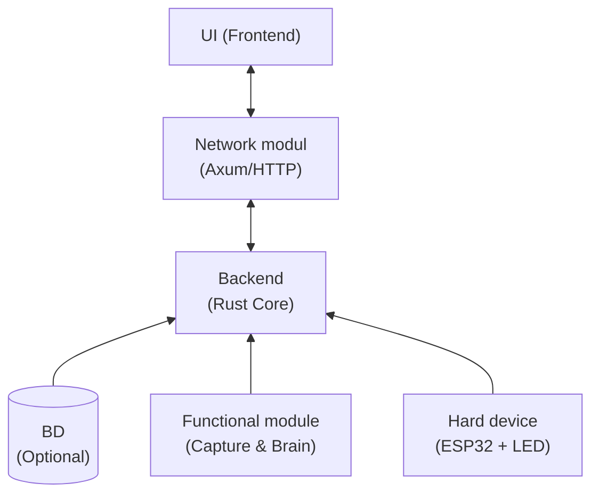

# Ambient Light: Системный демон подсветки

**Ambient Light** — это программно-аппаратный комплекс для глубокого погружения в контент. Система анализирует изображение на мониторе в реальном времени и проецирует доминирующие цвета на стену за ним через светодиодную ленту, визуально «стирая» границы экрана.

Проект создается как системный демон для **Linux (Manjaro KDE Plasma 6 Wayland)** с упором на производительность и кастомные протоколы передачи данных.

## Архитектура по заданию

Для соответствия учебному плану используется модульная структура, где UI и Backend разделены сетевой абстракцией:

## Реализация и стек технологий

### 🦀 Ядро (Backend) — Rust

Центральный модуль, написанный на **Rust**. Выбор продиктован необходимостью создания надежного демона с нулевой стоимостью абстракций (Zero-cost abstractions) и гарантированной безопасностью памяти.
Ядро организует работу четырех параллельных потоков:

1. **Web-server (Net):** Легковесный сервер на `axum` для взаимодействия с UI.
2. **Capture Worker (Func1):** Поток захвата кадров (C FFI).
3. **The Brain (Func2):** Вычислительный поток для анализа цветовых зон.
4. **Serial Link (Hard):** Поток управления передачей данных на контроллер.

### 🛠 Захват изображения (The "C" Worker) — C

Реализован на чистом **C**, так как работает напрямую с низкоуровневым API **PipeWire** и порталами Wayland. Интегрируется в Rust-проект через **FFI**, что позволяет достичь максимального FPS при минимальных задержках (latency).

### 🧠 Обработка (The Brain) — Rust
w
В этом модуле происходит магия: захваченный кадр разбивается на сегменты, после чего для каждого сегмента вычисляется средневзвешенный цвет. Использование итераторов и возможностей многопоточности Rust позволяет обрабатывать данные «на лету» без фризов основного интерфейса.

### 🌐 UI — HTML/JS

Пользовательский интерфейс в стиле CUPS: максимально простой и функциональный. Позволяет настраивать:

* Порт подключения (TTY)
* Общую яркость и насыщенность
* Зоны захвата и калибровку цвета

---

## Аппаратная часть

В роли «железа» выступает **ESP32**.

* **Dual-core:** Одно ядро занято парсингом входящего потока данных, второе — отрисовкой на адресной ленте (WS2812B/SK6812).
* **Asynchronous:** Такая архитектура исключает мерцание ленты при обработке тяжелых пакетов.

## Протокол передачи данных

Вместо готовых решений я реализую **собственный бинарный протокол**, чтобы минимизировать оверхед:

1. **Header:** Маркеры начала кадра для синхронизации.
2. **Payload:** Массив RGB-данных.
3. **Checksum:** Контрольная сумма **CRC** для защиты от помех в Serial-порту.
4. **Footer:** Стоп-байт.

---

*Проект разрабатывается в рамках курса «Расширенные возможности языков высокого уровня».*

