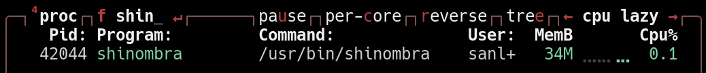

# Shinombra &mdash; экстремально быстрая и лёгкая амбиентная подсветка


<details>
  <summary>Посмотреть полное видео</summary>
  <video src="https://github.com/user-attachments/assets/3f40ef33-ac1f-4e66-aee5-8baea5a20e20"> </video>

  *Оригинальное видео: https://www.youtube.com/watch?v=1ZT6yWl3LPM*
</details>

Shinombra - это экстремально производительная амбиентная подсветка, с **нативной поддержкой PipeWire**, благодаря чему она способна работать с любым сервером (X11 и Wayland).

Shinombra была создана как эффективная альтернатива существующим решениям (например, Hyperion), т.к. большинство из них не способны корректно поддерживать захват изображения с Wayland.


## <span style="filter: grayscale(100%) brightness(35%)">⚡</span> Производительность

Архитектурный паттерн и использование Rust с C-FFI позволяет достичь максимальной производительности без утечек памяти. Shinombra захватывает DMA буфер, избегая копирование, а оптимизация алгоритмов позволяет сократить горячий цикл до минимума.

<p align="center">
  
</p>

|  CPU  |  RAM  |  FPS  |
| :---: | :---: | :---: |
| 0.1%  | 34Mib |  165  |


<details>
<summary><span style="color: light-dark( #343434a2, #c2c2c2a2);">Замеры проводились на данном железе<span></summary>

**PC:**
```
Operating System: Manjaro Linux 
KDE Plasma Version: 6.7.4
KDE Frameworks Version: 6.28.0
Qt Version: 6.11.1
Kernel Version: 6.18.42-1-MANJARO (64-bit)
Graphics Platform: Wayland
Processors: 16 × AMD Ryzen 7 5800H with Radeon Graphics
Memory: 64 GiB of RAM (62,2 GiB usable)
Graphics Processor 1: AMD Radeon Graphics
Graphics Processor 2: AMD Radeon RX 5500M
```

**LED:**
```
Custom on Wemos d1 mini
Blocks of led: 28
Connected: wire, Serial 2000000 bound rate
FPS: ~165Hz
```

**Shinombra config (максимально точный):**
```toml
[settings]
chunk_processor_type = "CrawlCheckerboard"
analytics_type = "Histogram"
filter_chain = [
    "BlackThreshold",
    "SaturationBoost",
    "FlashGuard",
    "Median",
    "Ema",
    "WhiteBalance",
    "Gamma",
]
hardware_output_type = "ShinombraSerial"

[frame_connection_config]
start_from = "Up"
direction = "Clockwise"

[screen_config]
frame_width_mm = 590
frame_height_mm = 330

[led_position_config]
gap = 10
led_length = 62
vertical_led_amount = 5
horizontal_led_amount = 9

[screen_reading_config]
deep_in = 10
deep_out = 5

[crawl_checkerboard_config]
pixel_step = 10
row_stride = 5
column_crawl = 2
row_crawl = 1

[histogram_config]
precision_level = 20

[gamma_config]
gamma = 2.2

[black_threshold_config]
threshold = 6
fade_range = 10
falloff_exponent = 1.5

[saturation_boost_config]
floor = 3
boost_exponent = 1.6

[white_balance_config]
kelvins = 4200

[flash_guard_config]
alpha = 0.5
sensitivity = 70

[ema_config]
alpha = 0.1

[shinombra_serial_config]
port_path = "/dev/ttyUSB0"
baud_rate = 2000000
```
</details>

## <span style="filter: grayscale(100%) contrast(40%) brightness(35%)">🛜</span> Протоколы

Shinombra нативно поддерживает:
 - **DDP**;
 - **DRGB (WLED)**.

Также реализован собственный протокол **ShinombraSerial**


## <span style="filter: grayscale(100%) contrast(40%) brightness(35%)">🚀</span> Быстрый старт

Для старта shinombra достаточно всего пары минут.

### Arch

Shinombra есть в AUR, поэтому для её установки Вам достаточно использовать свой любимый пакетный менеджер.

```bash
yay -S shinombra
# или
paur shinombra
```

### Manual

Для ручной сборки убедитесь, что у Вас установлены:

* gcc / clang;
* cargo;
* libpipewire-0.3;
* libportal;
* gio-2.0.

1. Клонируем репозиторий и переходим в директорию:
```bash
git clone https://github.com/sanlexandro/shinombra.git
cd ./shinombra
```
2. Собираем релизную версию ядра и утилит управления:
```bash
cargo build --release
```
3. Устанавливаем исполняемые файлы в систему (по умолчанию в /usr/local/bin):
```bash
sudo install -Dm755 target/release/shinombra /usr/local/bin/shinombra
sudo install -Dm755 target/release/shinombra-ui /usr/local/bin/shinombra-ui
sudo install -Dm755 tui/shinombra-tui.sh /usr/local/bin/shinombra-tui
```
4. Устанавливаем пользовательский systemd-сервис:
```bash
mkdir -p ~/.config/systemd/user/
cp packaging/shinombra.service ~/.config/systemd/user/
systemctl --user daemon-reload
```

После установки достаточно выполнить первые 4 шага [инструкции](./docs/manual.md), включающие в себя только замеры Вашего дисплея и настройка подключения к ленте!

## <span style="filter: grayscale(100%) contrast(120%) brightness(60%)">🎮</span> Использование

Подробнее об использовании читайте в [инструкции](./docs/manual.md).

### Запуск через web-UI:
Выполните команду:
```bash
shinombra-ui
```
Перейдите по указанному адресу в браузере и нажмите кнопку `Set Simple Mode in Service` для первичной настройки.

### Управление через TUI:
Для быстрой смены оверлеев и основного конфига выполните команду: 
```bash
shinombra-tui
```

### Прямой контроль над сервисом:

Для запуска выполните команду:
```bash
systemctl --user start shinombra.service 
```

Для остановки аналогично:
```bash
systemctl --user stop shinombra.service 
```


## <span style="filter: grayscale(100%) contrast(120%) brightness(60%)">🪾</span> Структура проекта

```
.
├── algorithms       <- Все алгоритмы, связанные с обработкой кадра
├── common           <- Общие модули
├── core             <- Ядро проекта
├── docs             <- Документация
├── ffi              <- Слой связи с C
├── hardware_output  <- Драйверы для устройств
├── infra            <- Макросы кодогенерации
├── packaging        <- Всё, необходимое для публикации
├── presets          <- Готовые пресеты
├── threads          <- Потоки захвата и отправки
├── tui              <- Интерфейс для сложной конфигурации
├── ui               <- Интерфейс для простой конфигурации
├── contributing.md  <- Правила контрибьютинга
├── readme.md        <- Файл, который Вы читаете
└── Cargo.toml       <- Описание workspace-а
```